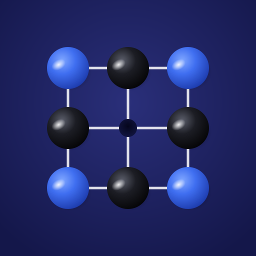
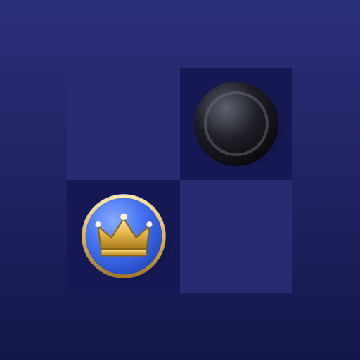
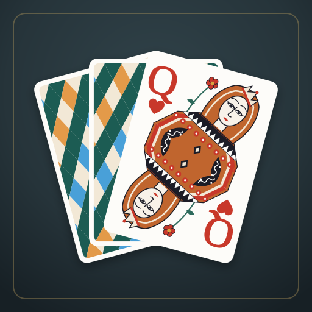
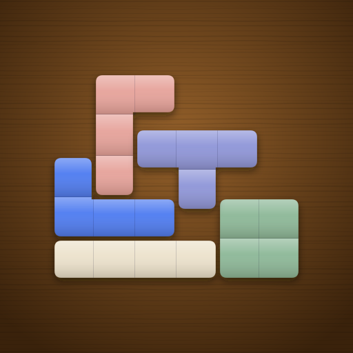
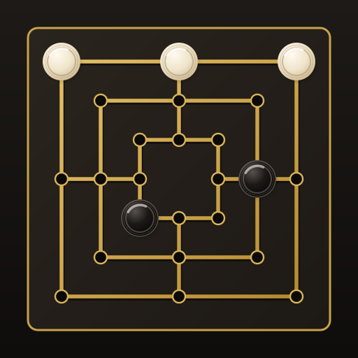
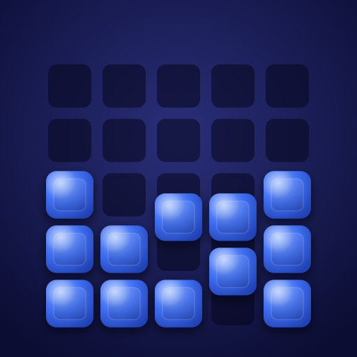

<div align="center">

# MIND PAUSE

**Calm, beautifully crafted puzzle games for iPhone and iPad.**

Classic board games, reimagined with tactile design and handcrafted sound. Free, offline, no ads.

[**▶ Open MIND PAUSE**](https://michaeldobner.github.io/mindpause/) · [Deutsch](README.de.md) · [Shell](shared/README.md)

[](https://github.com/michaeldobner/mindpause/actions/workflows/tests.yml)

</div>

## Games

| | Game | Description | Version |
|---|---|---|---|
|  | **[SPRING](spring/README.md)** · [play](https://michaeldobner.github.io/mindpause/spring/) | Peg solitaire on the classic cross-shaped board. Seven figures from easy to masterful, hints, a living rim, tilt | 2.1.2 |
|  | **[QUEEN](queen/README.md)** · [play](https://michaeldobner.github.io/mindpause/queen/) | German checkers against the computer at four levels or for two players on one device. Ebony, maple and an engraved golden crown, trays for captured pieces, your own pieces always at the bottom | 1.3.0 |
|  | **[KARO](karo/README.md)** · [play](https://michaeldobner.github.io/mindpause/karo/) | Classic solitaire as on Windows. Draw one or three, points or Vegas, levels that can always be solved, hints | 1.0.4 |
|  | **[FUGE](fuge/README.md)** · [play](https://michaeldobner.github.io/mindpause/fuge/) | The classic falling block game as a lacquered wooden box. Classic, Sprint, 3 minutes and an endless Calm mode, gestures instead of buttons, thumb controls in landscape | 1.1.0 |
|  | **[MÜHLE](muehle/README.md)** · [play](https://michaeldobner.github.io/mindpause/muehle/) | Nine men's morris against the computer on three levels or for two players on one device. Gold lines on black wood, glowing mills, trays as supply | 1.1.0 |
|  | **[BLOCKS](blocks/README.md)** · [play](https://michaeldobner.github.io/mindpause/blocks/) | The block puzzle: drag pieces from the tray onto the board, full rows and columns clear. 30 levels with starting blocks and rising difficulty, plus Classic 8 × 8, Wide 10 × 10 and an endless Calm mode, streaks, preview while dragging, pieces of blue ceramic | 1.1.0 |

More games and play across two devices are on the way, see the [roadmap](#roadmap).

## What every game shares

All games are built on one common **shell** in [`shared/`](shared/README.md). Change something there, for example a font, and it changes in every game.

| Shared | Meaning |
|---|---|
| **Design tokens** | Fonts, colours, spacing, shadows and motion in `shared/tokens.css` |
| **Interface** | Header, control bar, picker as sheet or drawer, open by itself on the first start, settings, result card with stars, toasts, first launch hint |
| **Layouts** | portrait and landscape on iPhone and iPad, in landscape header on the left, full height board, controls on the right, light and dark mode, safe areas |
| **Sound engine** | Ceramic on wood in four layers, three sound styles, respects the silent switch |
| **Living rim** | Physics for marbles and pieces in a rim or in trays: tap, swipe, tilt |
| **Languages** | German on German devices, English everywhere else |
| **Offline** | Every game installs as its own app on the home screen and works without internet |

Each game keeps its own rules, board, sounds, README, changelog, documentation, version and address.

## Repository structure

```
mindpause/
├─ index.html              home page of the collection (built from games.json)
├─ games.json              list of all games
├─ shared/                 the shell, see shared/README.md
│  ├─ tokens.css           design tokens
│  ├─ shell.css            layout and building blocks
│  ├─ js/                  shell, languages, storage, sound engine, physics, tilt
│  └─ tests/               tests of the shell
├─ spring/                 SPRING, see spring/README.md
├─ queen/                  QUEEN, see queen/README.md
├─ karo/                   KARO, see karo/README.md
├─ fuge/                   FUGE, see fuge/README.md
├─ muehle/                 MÜHLE, see muehle/README.md
├─ blocks/                 BLOCKS, see blocks/README.md
├─ scripts/
│  ├─ release.mjs          sets the version of a game or of the shell
│  └─ e2e.mjs              browser test of the whole collection
├─ tests/                  tests across the collection
└─ .github/workflows/      tests on every push
```

## Development

Requirements: Node.js 20 or newer and a modern browser. There are no dependencies and no build step.

```bash
npm start       # local server: http://localhost:3000/ (home), /spring/, /queen/
npm test        # logic tests of every game and the shell
npm run e2e     # browser test of every game on iPhone portrait and landscape, iPhone SE and iPad landscape
E2E_ENGINE=webkit npm run e2e   # the same in WebKit, the engine of Safari
```

The browser test needs Playwright once: `npm install --no-save playwright && npx playwright install chromium`.

On every push GitHub Actions runs both. The browser test uploads screenshots of every game as a download (artifact "screenshots"), so changes to the shell can be checked visually across all games.

## Publishing

* **Hosting:** GitHub Pages, branch `main`, folder `/ (root)`. Free for public repositories.
* **Way of working:** every change goes through a pull request. Once the tests are green it is merged into `main` and the branch is deleted automatically. One or two minutes later it is live.
* **Versions:** every game has its own version, the shell has its own version too.

```bash
node scripts/release.mjs spring 2.2.0   # new version of SPRING
node scripts/release.mjs shell 1.5.0    # new version of the shell, affects every game
```

Every reference carries its version (`?v=` for game files, `?shell=` for shell files). A device therefore never mixes old and new files after an update. `tests/release.test.js` checks this on every push.

## Adding a game

1. Create a folder with the game's id, for example `mill/`.
2. Use the same structure as `spring/`: `index.html`, `js/main.js`, `js/strings.js`, `css/<id>.css`, `sw.js`, `manifest.webmanifest`, `icons/`, `tests/`, `README.md`, `README.de.md`, `CHANGELOG.md`, `CHANGELOG.de.md`, `docs/de`, `docs/en`.
3. In `main.js` call `createShell()` from the shell, see [shell documentation](shared/README.md#connecting-a-game).
4. Provide `window.__game` with `history` and `e2e.move()` for the browser test.
5. Add an entry to `games.json`. The home page, the release script and the tests pick it up automatically.
6. Add a row to the games table above.

## Roadmap

| Step | Contents | Status |
|---|---|---|
| SPRING | Peg solitaire, 7 figures, hints, tilt | Done |
| Collection | Shell, home page, tests across all games | Done |
| QUEEN | German checkers, four computer levels, two players on one device | Done |
| KARO | Klondike solitaire, draw one or three, Windows and Vegas scoring, solvable levels | Done |
| FUGE | Falling blocks as a wooden box, four modes, gestures, shell 1.3.0 with custom buttons | Done |
| MÜHLE | Nine men's morris with WMD rules, three computer levels, two players, design from QUEEN | Done |
| Landscape | Shell 1.5.0: landscape for every game, full height board, your own pieces at the bottom, FUGE with thumb controls | Done |
| BLOCKS | Block puzzle with three modes, streak and preview, colours of SPRING and QUEEN Midnight | Done |
| BLOCKS 1.1 | 30 levels in six chapters with a sawtooth difficulty curve, each one checked to be solvable | Done |
| QUEEN 1.4 | Playing each other on two devices, stage 1: move by link | Planned |
| Later | Live with a room code, more games | Idea |

## Writing style

Texts and documentation are always written in German and English, without dashes. Code comments are in German.
