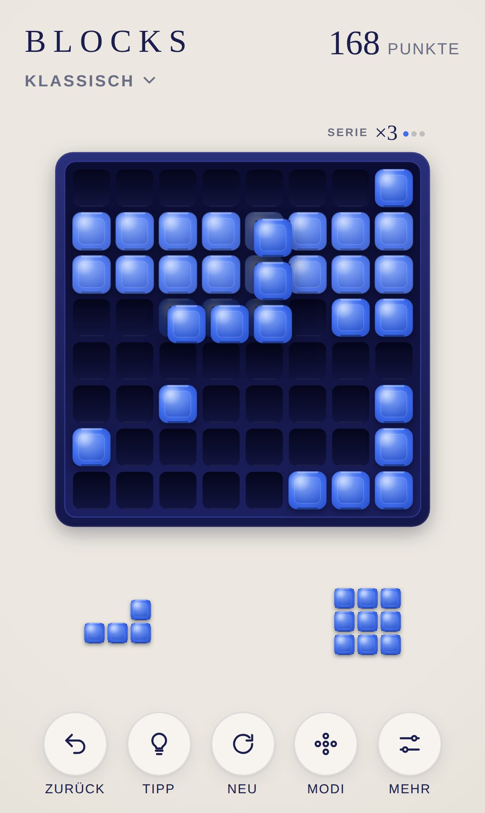
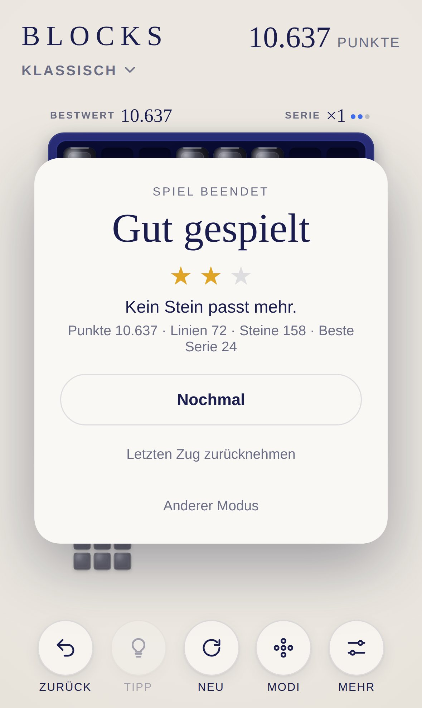
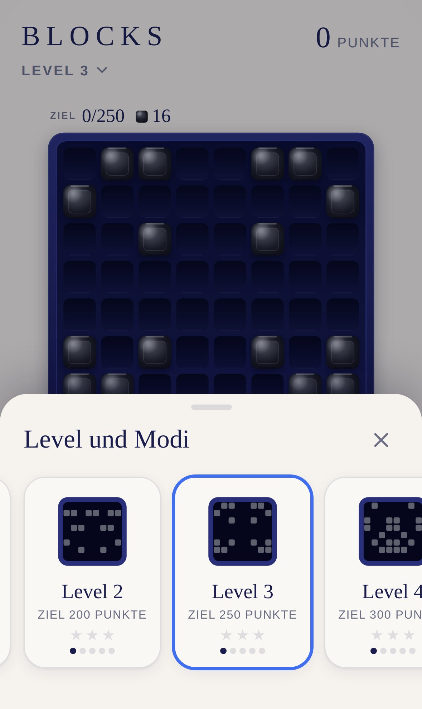

<div align="center">

# BLOCKS

**Block-Puzzle für iPhone und iPad.**

Steine vom Tablett aufs Brett legen, volle Reihen und Spalten räumen ab. 30 Level mit schwarzen Startsteinen und drei freie Modi, auf einer nachtblauen Platte mit Steinen aus blauer Keramik.

[**▶ Jetzt spielen**](https://michaeldobner.github.io/mindpause/blocks/) · [English](README.md) · [Dokumentation](docs/de/README.md) · [Changelog](CHANGELOG.de.md)

Ein Spiel der Sammlung [MIND PAUSE](../README.de.md).

[](https://github.com/michaeldobner/mindpause/actions/workflows/tests.yml)

&nbsp;&nbsp;
&nbsp;&nbsp;


</div>

## Warum BLOCKS

Das Spiel, das jeder kennt: drei Steine auf dem Tablett, ein quadratisches Brett, und die Frage, wohin der nächste Stein passt, ohne den übernächsten zu blockieren. BLOCKS spielt sich wie das Original, sieht aber aus wie die übrigen Spiele der Sammlung. Die Platte trägt das Nachtblau von SPRING, die Steine sind aus der blauen Keramik des Stils Mitternacht von QUEEN. Kein Feuer, keine Explosionen, keine Werbung, kein Konto, kein Tracking. Läuft im Browser, lässt sich wie eine App installieren und funktioniert offline.

## Highlights

| | |
|---|---|
| **30 Level** | Jedes Level beginnt mit schwarzen Startsteinen. Ziel: alle abräumen und das Punkteziel erreichen. Sechs Kapitel mit steigender Schwierigkeit, neue Formen kommen nach und nach dazu |
| **Sterne und Fortschritt** | Je weniger Steine, desto mehr Sterne. Geschaffte Level schalten das nächste frei, der Stand bleibt auf dem Gerät |
| **Drei freie Modi** | Klassisch (8 × 8), Weit (10 × 10) und Ruhe (ohne Ende), jeweils mit leicht belegtem Startbrett |
| **Fairer Start** | Die ersten drei Steine passen immer, in jedem Level und jedem Modus |
| **Ruhe** | Alle drei Steine passen immer. Passt trotzdem nichts mehr, räumt sich das Brett sanft auf und es geht weiter |
| **Serie** | Wer immer wieder abräumt, vervielfacht seine Punkte. Drei Punkte über dem Brett zeigen, wie lange die Serie noch hält |
| **Vorschau** | Beim Ziehen zeigt das Brett, wo der Stein landet und welche Reihen und Spalten verschwinden würden |
| **Ziehen wie gewohnt** | Der Stein schwebt über dem Finger und rastet auf dem nächsten freien Platz ein |
| **Zurück und Tipp** | Den letzten Stein zurücknehmen, auch nach dem Ende. Der Tipp zeigt einen guten Platz in Gold |
| **Tastatur** | 1, 2, 3 wählen einen Stein, Pfeile schieben, Enter legt |
| **Klangdesign** | Keramik auf Holz wie in der ganzen Sammlung, Linien klingen aufsteigend, mit der Serie höher |
| **Für Apple-Geräte gemacht** | iPhone und iPad hoch und quer, Hell- und Dunkelmodus, Spiel wird nach jedem Stein gespeichert |

## So wird gespielt

1. Ziehe einen der drei Steine vom Tablett aufs Brett. Steine lassen sich nicht drehen.
2. Eine **volle Reihe** oder **volle Spalte** verschwindet. Mehrere auf einmal bringen mehr Punkte.
3. Sind alle drei Steine gelegt, kommen drei neue.
4. **Im Level** räumst du alle schwarzen Startsteine ab und erreichst das Punkteziel. Dann ist das Level geschafft.
5. Passt keiner der übrigen Steine mehr aufs Brett, ist das Spiel vorbei.

Alle Regeln, Level, Punkte und Modi: [Spielregeln](docs/de/spielregeln.md).

## Bedienung

| iPhone und iPad | Rechner | Wirkung |
|---|---|---|
| Stein vom Tablett ziehen | Ziehen mit der Maus oder 1, 2, 3 | Stein wählen |
| Loslassen über dem Brett | Pfeile, dann Enter oder Leertaste | Stein legen |
| Loslassen daneben | Escape | Stein zurück aufs Tablett |
| **Zurück** | Z, Rücktaste oder Strg+Z | letzten Stein zurücknehmen |
| **Tipp** | H | guten Platz zeigen |

## Auf iPhone oder iPad installieren

1. **https://michaeldobner.github.io/mindpause/blocks/** in **Safari** öffnen.
2. Auf **Teilen** tippen, dann **Zum Home-Bildschirm**.
3. Fertig. BLOCKS startet im Vollbild wie eine App und funktioniert auch ohne Internet.

## Dokumentation

| Dokument | Inhalt |
|---|---|
| [Spielregeln](docs/de/spielregeln.md) | Regeln, Level, Formen, Modi, Punkte, Serie, Sterne, Bedienung |
| [Design-System](docs/de/design.md) | Leitidee, Name, Farben, Steine, Layouts, Bewegung, Klang |
| [Architektur](docs/de/architektur.md) | Module, Datenmodell, Level und ihr Erzeugen, Ziehen, Füllen des Tabletts, Tests |

## Schnellstart für Entwicklung

Aus dem Hauptordner des Repositorys:

```bash
npm start                           # lokaler Server, dann http://localhost:3000/blocks/ öffnen
npm test                            # Logik-Tests der ganzen Sammlung
npm run e2e                         # Browser-Test auf iPhone und iPad
node blocks/tools/bot.mjs           # Computerspieler, schätzt die Grenzen für die Sterne
node blocks/tools/levels.mjs        # erzeugt die 30 Level und spielt jedes durch
```

Keine Abhängigkeiten, kein Build-Schritt. Alles, was BLOCKS mit den anderen Spielen teilt, kommt aus der [Hülle](../shared/README.de.md).

## Ordnerstruktur

```
blocks/
├─ index.html              Einstiegsseite, lädt die Hülle und BLOCKS
├─ css/blocks.css          Bühne für das Canvas
├─ js/
│  ├─ main.js              verbindet BLOCKS mit der Hülle: Level und Modi, Fortschritt, Zurück, Tipp, Ergebnis
│  ├─ strings.js           Texte auf Deutsch und Englisch
│  ├─ shapes.js            Formen, Drehungen und Spiegelungen, Zufall mit Gewichten
│  ├─ modes.js             Modi, Punkte, Serie, Sterne
│  ├─ levels.js            30 Level: Kurve der Schwierigkeit, Formen je Kapitel, Sterne
│  ├─ level-data.js        Startbretter und Richtwerte, erzeugt von tools/levels.mjs
│  ├─ game.js              Spiellogik: Legen, Abräumen, Füllen des Tabletts, Ende, Tipp, Speichern
│  ├─ view.js              Platte, Steine, Tablett und Animationen auf Canvas
│  ├─ input.js             Ziehen mit Finger und Maus, Tastatur
│  └─ sound.js             Klänge, auf der Klang-Engine der Hülle
├─ tools/
│  ├─ icons.mjs            erzeugt die App-Symbole
│  ├─ screenshots.mjs      erzeugt die Bilder der Dokumentation
│  ├─ levels.mjs           erzeugt die Level und prüft, dass jedes lösbar ist
│  └─ bot.mjs              Computerspieler für die Grenzen der Sterne
├─ icons/                  App-Symbole
├─ sw.js                   Offline-Betrieb
├─ manifest.webmanifest    Installation als App
├─ tests/                  automatische Tests
└─ docs/                   Dokumentation (de, en, Bilder)
```

## Version

Aktuelle Version: **1.1.1**. Siehe [Changelog](CHANGELOG.de.md).
