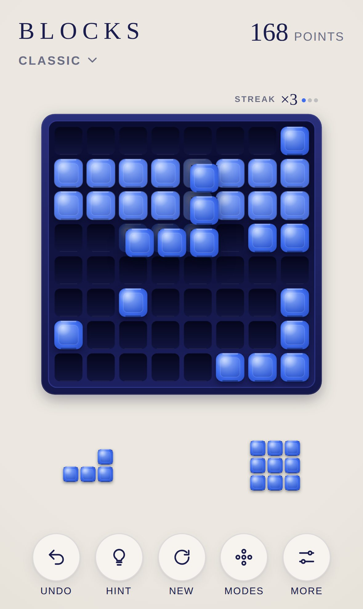

<div align="center">

# BLOCKS

**Block puzzle for iPhone and iPad.**

Drag pieces from the tray onto the board, full rows and columns clear. 30 levels with black starting blocks and three free modes, on a night blue plate with pieces of blue ceramic.

[**▶ Play now**](https://michaeldobner.github.io/mindpause/blocks/) · [Deutsch](README.de.md) · [Documentation](docs/en/README.md) · [Changelog](CHANGELOG.md)

A game of the [MIND PAUSE](../README.md) collection.

[](https://github.com/michaeldobner/mindpause/actions/workflows/tests.yml)

&nbsp;&nbsp;
&nbsp;&nbsp;


</div>

## Why BLOCKS

The game everyone knows: three pieces on the tray, a square board, and the question of where the next piece fits without blocking the one after. BLOCKS plays like the original but looks like the other games of the collection. The plate wears the night blue of SPRING, the pieces are made of the blue ceramic of the QUEEN Midnight style. No fire, no explosions, no ads, no account, no tracking. Runs in the browser, installs like an app and works offline.

## Highlights

| | |
|---|---|
| **30 levels** | Every level starts with black starting blocks. Goal: clear them all and reach the points goal. Six chapters of rising difficulty, new shapes arrive step by step |
| **Stars and progress** | The fewer pieces, the more stars. A completed level unlocks the next one, progress stays on the device |
| **Three free modes** | Classic (8 × 8), Wide (10 × 10) and Calm (no end), each with a lightly filled starting board |
| **Fair start** | The first three pieces always fit, in every level and every mode |
| **Calm** | All three pieces always fit. If nothing fits after all, the board clears gently and play goes on |
| **Streak** | Keep clearing and your points multiply. Three dots above the board show how long the streak still holds |
| **Preview** | While dragging, the board shows where the piece lands and which rows and columns would clear |
| **Familiar dragging** | The piece floats above your finger and snaps to the nearest free spot |
| **Undo and hint** | Take back the last piece, even after the end. The hint shows a good spot in gold |
| **Keyboard** | 1, 2, 3 choose a piece, arrows move it, Enter places it |
| **Sound design** | Ceramic on wood as in the whole collection, lines ring in a rising scale, higher with the streak |
| **Made for Apple devices** | iPhone and iPad in portrait and landscape, light and dark mode, the game is saved after every piece |

## How to play

1. Drag one of the three pieces from the tray onto the board. Pieces cannot be rotated.
2. A **full row** or **full column** clears. Several at once score more.
3. Once all three pieces are placed, three new ones arrive.
4. **In a level** you clear all black starting blocks and reach the points goal. Then the level is complete.
5. When none of the remaining pieces fits on the board, the game is over.

All rules, levels, points and modes: [Gameplay](docs/en/gameplay.md).

## Controls

| iPhone and iPad | Computer | Effect |
|---|---|---|
| Drag a piece from the tray | Drag with the mouse or 1, 2, 3 | choose a piece |
| Release over the board | Arrows, then Enter or Space | place the piece |
| Release elsewhere | Escape | piece goes back to the tray |
| **Undo** | Z, Backspace or Ctrl+Z | take back the last piece |
| **Hint** | H | show a good spot |

## Install on iPhone or iPad

1. Open **https://michaeldobner.github.io/mindpause/blocks/** in **Safari**.
2. Tap **Share**, then **Add to Home Screen**.
3. Done. BLOCKS starts full screen like an app and works without internet.

## Documentation

| Document | Contents |
|---|---|
| [Gameplay](docs/en/gameplay.md) | Rules, levels, shapes, modes, points, streak, stars, controls |
| [Design system](docs/en/design.md) | Concept, name, colours, pieces, layouts, motion, sound |
| [Architecture](docs/en/architecture.md) | Modules, data model, levels and how they are made, dragging, filling the tray, tests |

## Quick start for development

From the root of the repository:

```bash
npm start                           # local server, then open http://localhost:3000/blocks/
npm test                            # logic tests of the whole collection
npm run e2e                         # browser test on iPhone and iPad
node blocks/tools/bot.mjs           # computer player, estimates the limits for the stars
node blocks/tools/levels.mjs        # creates the 30 levels and plays through each
```

No dependencies, no build step. Everything BLOCKS shares with the other games comes from the [shell](../shared/README.md).

## Folder structure

```
blocks/
├─ index.html              entry page, loads the shell and BLOCKS
├─ css/blocks.css          stage for the canvas
├─ js/
│  ├─ main.js              connects BLOCKS to the shell: levels and modes, progress, undo, hint, result
│  ├─ strings.js           texts in German and English
│  ├─ shapes.js            shapes, rotations and mirror images, weighted random
│  ├─ modes.js             modes, points, streak, stars
│  ├─ levels.js            30 levels: difficulty curve, shapes per chapter, stars
│  ├─ level-data.js        starting boards and par values, created by tools/levels.mjs
│  ├─ game.js              game logic: placing, clearing, filling the tray, end, hint, saving
│  ├─ view.js              plate, pieces, tray and animations on canvas
│  ├─ input.js             dragging with finger and mouse, keyboard
│  └─ sound.js             sounds, built on the sound engine of the shell
├─ tools/
│  ├─ icons.mjs            creates the app icons
│  ├─ screenshots.mjs      creates the images of the documentation
│  ├─ levels.mjs           creates the levels and checks that each one can be solved
│  └─ bot.mjs              computer player for the star limits
├─ icons/                  app icons
├─ sw.js                   offline support
├─ manifest.webmanifest    install as an app
├─ tests/                  automated tests
└─ docs/                   documentation (de, en, images)
```

## Version

Current version: **1.1.0**. See the [changelog](CHANGELOG.md).
