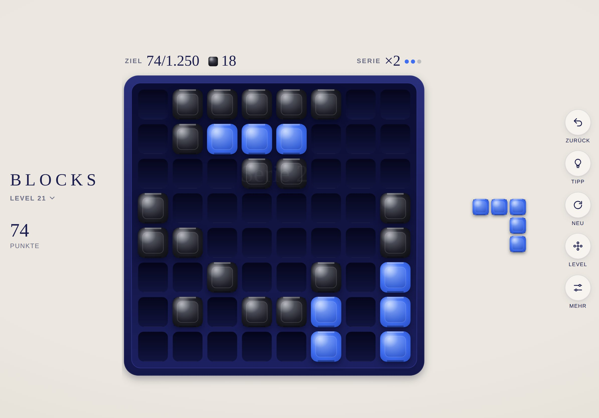

# BLOCKS · Documentation

[Deutsche Version](../de/README.md) · [Back to the game](../../README.md)

| Document | Contents | For |
|---|---|---|
| [Gameplay](gameplay.md) | Rules, levels, shapes, modes, points, streak, stars, controls | Everyone |
| [Design system](design.md) | Concept, name, colours, pieces, layouts, motion, sound | Design, development |
| [Architecture](architecture.md) | Modules, data model, dragging, filling the tray, tests | Development |

## BLOCKS at a glance

| | |
|---|---|
| Game | Block puzzle: place pieces on the board, full rows and columns clear |
| Content | 30 levels, three free modes, streak, preview while dragging, undo, hint, best scores, stars |
| Platform | Progressive web app for iPhone and iPad, runs in every modern browser |
| Languages | German and English, chosen by the device language |
| Technology | HTML, CSS, JavaScript modules, canvas, Web Audio, no framework, no build step |
| Collection | Part of [MIND PAUSE](../../../README.md), interface from the [shell](../../../shared/README.md) |
| Address | https://michaeldobner.github.io/mindpause/blocks/ |
| Version | 1.1.0 |

