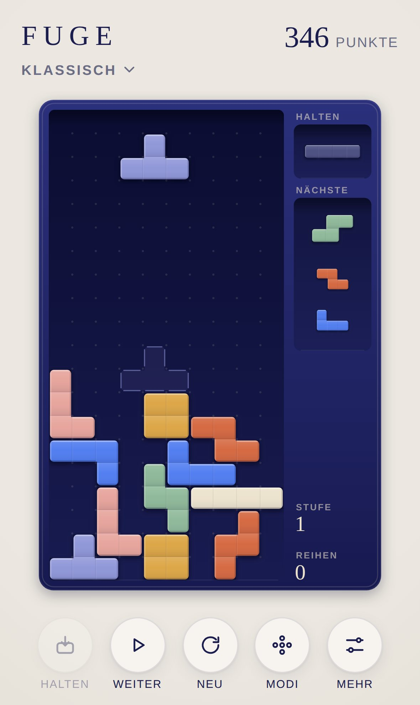
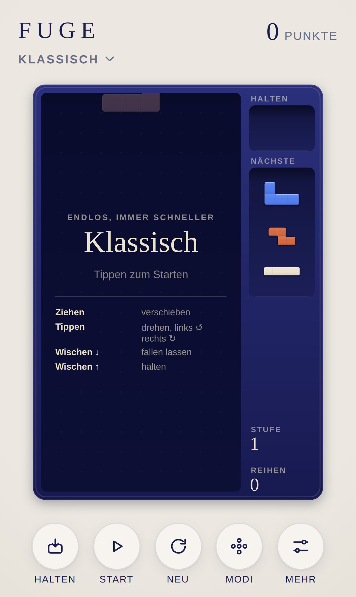
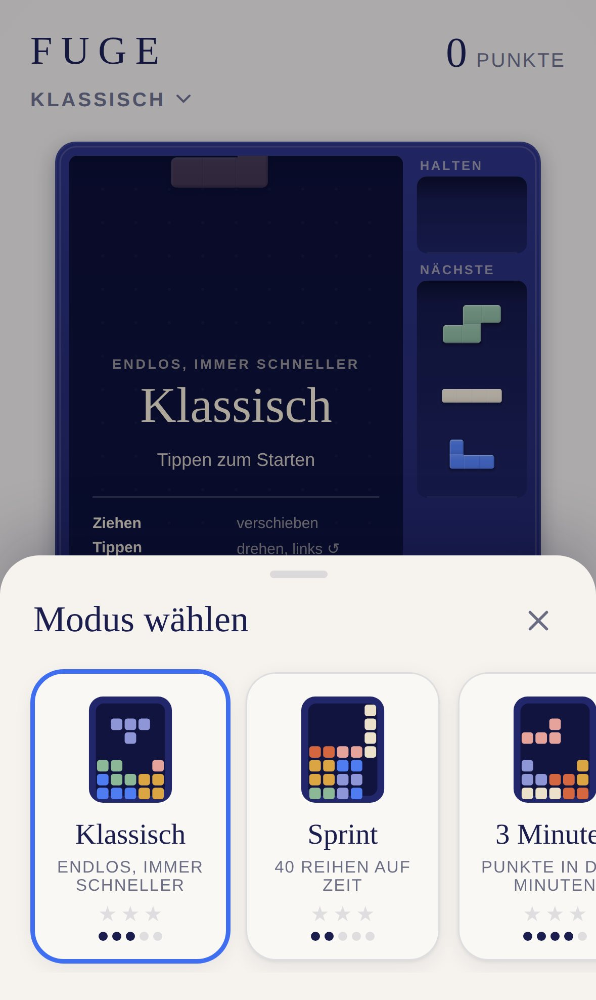

<div align="center">

# FUGE

**Fallende Steine für iPhone und iPad.**

Das klassische Spiel, das jeder kennt. Als lackierter Holzkasten, in dem matte Steine passgenau ineinandergreifen.

[**▶ Jetzt spielen**](https://michaeldobner.github.io/mindpause/fuge/) · [English](README.md) · [Dokumentation](docs/de/README.md) · [Changelog](CHANGELOG.de.md)

Ein Spiel der Sammlung [MIND PAUSE](../README.de.md).

[](https://github.com/michaeldobner/mindpause/actions/workflows/tests.yml)

&nbsp;&nbsp;
&nbsp;&nbsp;


</div>

## Warum FUGE

Eine Fuge ist der schmale Spalt zwischen zwei Steinen, und in der Musik ein Stück, in dem eine Stimme nach der anderen einsetzt. Genau das passiert hier: Ein Stein nach dem anderen fällt in den Kasten, und wer die Fugen schließt, räumt Reihen ab.

FUGE spielt sich wie das Original, sieht aber aus wie ein Designobjekt für den Couchtisch. Jeder Stein ist ein zusammenhängendes Werkstück aus matt lackiertem Holz, mit gerundeten Außenkanten und einer hauchfeinen Naht zwischen seinen vier Feldern. Kein Neon, keine Pixel, keine Explosionen. Keine Werbung, kein Konto, kein Tracking. Läuft im Browser, lässt sich wie eine App installieren und funktioniert offline.

## Highlights

| | |
|---|---|
| **Vier Modi** | Klassisch (endlos, immer schneller), Sprint (40 Reihen auf Zeit), 3 Minuten (Punkte in fester Zeit) und Ruhe (langsam, ohne Ende) |
| **Ruhe** | Kein Game Over: Ist der Kasten voll, löst er sich sanft auf und es geht weiter. Ein Modus für die Pause im Kopf |
| **Moderne Mechanik** | 7-Bag-Zufall, Vorschau auf drei Steine, Halten, Geisterstein, Drehen nach SRS mit Wandsprüngen, Frist am Boden |
| **Punkte nach Guideline** | T-Dreh mit Mini, Folge (Back-to-Back), Serie, Leer geräumt. Vier Reihen auf einmal heißen hier **Quart** |
| **Gesten statt Knöpfe** | Ziehen verschiebt Feld für Feld, Tippen dreht, Wischen nach unten lässt fallen, nach oben hält |
| **Tastatur** | Pfeile, Leertaste, C und P wie gewohnt, mit verzögerter Wiederholung beim Gedrückthalten |
| **Spielgefühl** | Steine gleiten weich, drehen sich sichtbar, setzen sich mit einem Aufleuchten. Volle Reihen lösen sich von der Mitte aus auf |
| **Klangdesign** | Holz auf Holz: leises Klicken, Klacken beim Drehen, dumpfes Aufsetzen. Reihen klingen mit dem Keramikton der Sammlung |
| **Barrierearm** | Optionale Muster auf den Steinen für Farbsehschwäche, „Bewegung reduzieren“ wird respektiert |
| **Für Apple-Geräte gemacht** | iPhone hoch und quer, iPad mit Seitenleiste, Hell- und Dunkelmodus, Spiel wird beim Verlassen gespeichert |

## So wird gespielt

1. Steine fallen von oben in den Kasten. Verschieben und drehen, bis der Stein passt.
2. Eine **volle Reihe** verschwindet, alles darüber rutscht nach.
3. Alle **10 Reihen** steigt die Stufe, die Steine fallen schneller.
4. Reicht der Platz für den nächsten Stein nicht mehr, ist das Spiel vorbei.

Alle Regeln, Punkte und Modi: [Spielregeln](docs/de/spielregeln.md).

## Bedienung

| iPhone und iPad | Rechner | Wirkung |
|---|---|---|
| Ziehen links oder rechts | ← → oder A D | verschieben |
| Tippen, rechte Hälfte | ↑, X oder W | drehen im Uhrzeigersinn |
| Tippen, linke Hälfte | Z, Q oder Strg | drehen gegen den Uhrzeigersinn |
| Langsam nach unten ziehen | ↓ oder S | schneller fallen |
| Schnell nach unten wischen | Leertaste | fallen lassen |
| Nach oben wischen, Fach antippen oder **Halten** | C oder Shift | halten |
| **Pause** | P oder Escape | Pause |

## Auf iPhone oder iPad installieren

1. **https://michaeldobner.github.io/mindpause/fuge/** in **Safari** öffnen.
2. Auf **Teilen** tippen, dann **Zum Home-Bildschirm**.
3. Fertig. FUGE startet im Vollbild wie eine App und funktioniert auch ohne Internet.

## Dokumentation

| Dokument | Inhalt |
|---|---|
| [Spielregeln](docs/de/spielregeln.md) | Regeln, Modi, Punkte, Stufen, Sterne, Bedienung |
| [Design-System](docs/de/design.md) | Leitidee, Farben, Steine, Kasten, Layouts, Bewegung, Klang |
| [Architektur](docs/de/architektur.md) | Module, Datenmodell, Ablauf eines Bildes, Eingabe, Tests |

## Schnellstart für Entwicklung

Aus dem Hauptordner des Repositorys:

```bash
npm start                         # lokaler Server, dann http://localhost:3000/fuge/ öffnen
npm test                          # Logik-Tests der ganzen Sammlung
npm run e2e                       # Browser-Test auf iPhone und iPad
node fuge/tools/playtest.mjs      # Spieltest mit Gesten und Tasten (braucht Playwright)
```

Keine Abhängigkeiten, kein Build-Schritt. Alles, was FUGE mit den anderen Spielen teilt, kommt aus der [Hülle](../shared/README.de.md).

## Technik

| Bereich | Umsetzung |
|---|---|
| Sprache | HTML, CSS, JavaScript (ES-Module) |
| Darstellung | Zwei Canvas-Ebenen: Kasten und Stapel nur bei Änderungen, fallender Stein und Effekte jedes Bild |
| Steine | Jede Zelle als vorgezeichnetes Sprite je Form und Nachbarschaft, gestochen scharf auf jedem Display |
| Logik | Reine Spiellogik ohne DOM, zeitgesteuert über `step(dt)`, Ereignisse für Darstellung und Klang |
| Klang | Web Audio API, live erzeugt, keine Audiodateien |
| Offline | Eigener Service Worker und Web App Manifest |
| Tests | Node.js Test-Runner, Playwright-Browser-Test und Spieltest |

## Ordnerstruktur

```
fuge/
├─ index.html              Einstiegsseite, lädt die Hülle und FUGE
├─ css/fuge.css            Bühne, Karte für Start und Pause
├─ js/
│  ├─ main.js              verbindet FUGE mit der Hülle: Modi, Pause, Statistik, Bild für Bild
│  ├─ strings.js           Texte auf Deutsch und Englisch
│  ├─ pieces.js            sieben Formen, Drehungen nach SRS, Wandsprünge, 7-Bag
│  ├─ modes.js             Modi, Geschwindigkeit, Punkte, Sterne
│  ├─ game.js              Spiellogik: Schwerkraft, Frist am Boden, Halten, Reihen, Speichern
│  ├─ view.js              Kasten, Steine, Animationen auf Canvas
│  ├─ input.js             Tastatur mit Wiederholung und Gesten
│  └─ sound.js             Klänge, auf der Klang-Engine der Hülle
├─ tools/
│  ├─ icons.mjs            erzeugt die App-Symbole
│  ├─ screenshots.mjs      erzeugt die Bilder der Dokumentation
│  └─ playtest.mjs         Spieltest im Browser
├─ icons/                  App-Symbole
├─ sw.js                   Offline-Betrieb
├─ manifest.webmanifest    Installation als App
├─ tests/                  automatische Tests
└─ docs/                   Dokumentation (de, en, Bilder)
```

## Version

Aktuelle Version: **1.0.0**. Siehe [Changelog](CHANGELOG.de.md).
