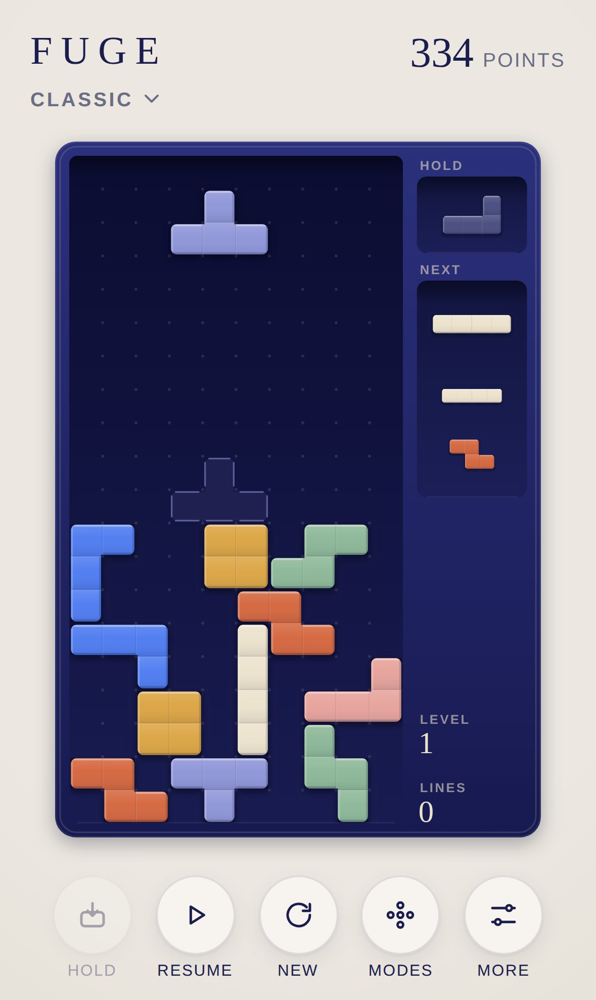
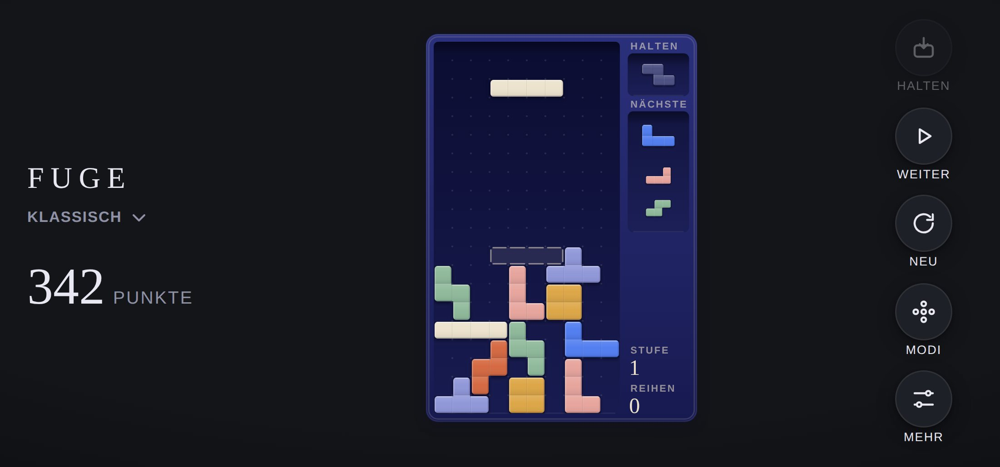

<div align="center">

# FUGE

**Falling blocks for iPhone and iPad.**

The classic game everyone knows. As a lacquered wooden box in which matte pieces fit together precisely.

[**▶ Play now**](https://michaeldobner.github.io/mindpause/fuge/) · [Deutsch](README.de.md) · [Documentation](docs/en/README.md) · [Changelog](CHANGELOG.md)

A game of the [MIND PAUSE](../README.md) collection.

[](https://github.com/michaeldobner/mindpause/actions/workflows/tests.yml)

&nbsp;&nbsp;


</div>

## Why FUGE

*Fuge* is German for the narrow joint between two stones, and the musical fugue, in which one voice enters after another. That is exactly what happens here: one piece after another drops into the box, and closing the joints clears lines.

FUGE plays like the original but looks like a design object for the coffee table. Every piece is one solid workpiece of matte lacquered wood, with rounded outer edges and a hairline seam between its four cells. No neon, no pixels, no explosions. No ads, no account, no tracking. Runs in the browser, installs like an app and works offline.

## Highlights

| | |
|---|---|
| **Four modes** | Classic (endless, ever faster), Sprint (40 lines against the clock), 3 minutes (score in fixed time) and Calm (slow, no end) |
| **Calm** | No game over: when the box is full it dissolves gently and play goes on. A mode for a pause of the mind |
| **Modern mechanics** | 7-bag randomizer, three-piece preview, hold, ghost piece, SRS rotation with wall kicks, lock delay |
| **Guideline scoring** | T-spins including mini, back to back, combos, all clear. Four lines at once are called a **Quart** |
| **Gestures, not buttons** | Drag to move cell by cell, tap to rotate, swipe down to drop, up to hold |
| **Keyboard** | Arrows, space, C and P as usual, with delayed auto repeat |
| **Game feel** | Pieces glide softly, rotate visibly, settle with a gleam. Full lines dissolve from the centre outwards |
| **Sound design** | Wood on wood: soft clicks, a clack when rotating, a muffled set down. Lines ring with the collection's ceramic tone |
| **Accessible** | Optional patterns on the pieces for colour blindness, respects “Reduce motion” |
| **Made for Apple devices** | iPhone and iPad in portrait and landscape, full height board in landscape, light and dark mode, game saved when you leave |

## How to play

1. Pieces fall into the box from above. Move and rotate them until they fit.
2. A **full line** disappears, everything above slides down.
3. Every **10 lines** the level rises and the pieces fall faster.
4. When there is no room for the next piece, the game is over.

All rules, scoring and modes: [Gameplay](docs/en/gameplay.md).

## Controls

| iPhone and iPad | Computer | Action |
|---|---|---|
| Drag left or right | ← → or A D | move |
| Tap, right half | ↑, X or W | rotate clockwise |
| Tap, left half | Z, Q or Ctrl | rotate counterclockwise |
| Drag down slowly | ↓ or S | fall faster |
| Swipe down quickly | Space | drop |
| Swipe up, tap the hold box or **Hold** | C or Shift | hold |
| **Pause** | P or Escape | pause |

## Install on iPhone or iPad

1. Open **https://michaeldobner.github.io/mindpause/fuge/** in **Safari**.
2. Tap **Share**, then **Add to Home Screen**.
3. Done. FUGE starts full screen like an app and works without internet.

## Documentation

| Document | Contents |
|---|---|
| [Gameplay](docs/en/gameplay.md) | Rules, modes, scoring, levels, stars, controls |
| [Design system](docs/en/design.md) | Concept, colours, pieces, box, layouts, motion, sound |
| [Architecture](docs/en/architecture.md) | Modules, data model, frame loop, input, tests |

## Quick start for development

From the repository root:

```bash
npm start                         # local server, then open http://localhost:3000/fuge/
npm test                          # logic tests of the whole collection
npm run e2e                       # browser test on iPhone and iPad
node fuge/tools/playtest.mjs      # play test with gestures and keys (needs Playwright)
```

No dependencies, no build step. Everything FUGE shares with the other games comes from the [shell](../shared/README.md).

## Version

Current version: **1.0.1**. See [changelog](CHANGELOG.md).
