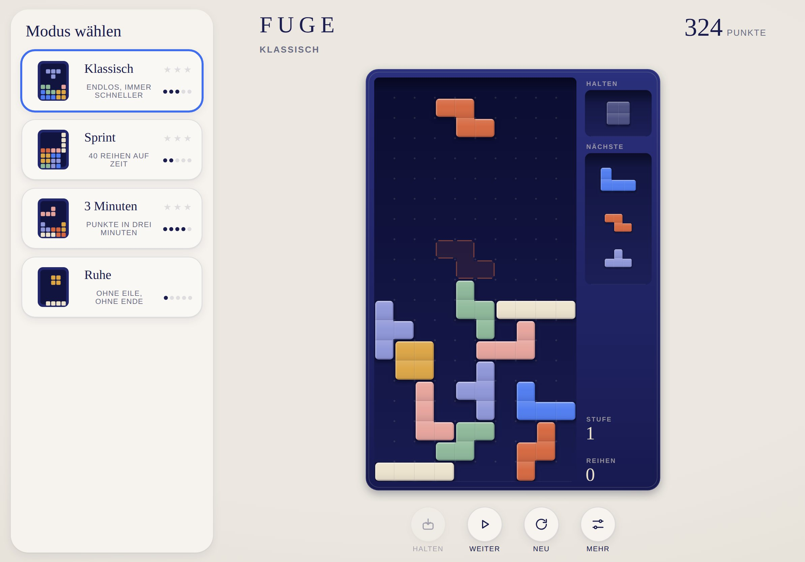

# FUGE · Dokumentation

[English version](../en/README.md) · [Zurück zum Spiel](../../README.de.md)

| Dokument | Inhalt | Für wen |
|---|---|---|
| [Spielregeln](spielregeln.md) | Regeln, Modi, Punkte, Stufen, Sterne, Bedienung | Alle |
| [Design-System](design.md) | Leitidee, Name, Farben, Steine, Kasten, Layouts, Bewegung, Klang | Design, Entwicklung |
| [Architektur](architektur.md) | Module, Datenmodell, Ablauf eines Bildes, Eingabe, Tests | Entwicklung |

## FUGE auf einen Blick

| | |
|---|---|
| Spiel | Das klassische Spiel mit fallenden Steinen |
| Inhalt | Vier Modi, Halten, Vorschau, Geisterstein, Punkte nach Guideline, Bestwerte, Sterne |
| Plattform | Progressive Web App für iPhone und iPad, läuft in jedem modernen Browser |
| Sprachen | Deutsch und Englisch, automatisch nach Gerätesprache |
| Technik | HTML, CSS, JavaScript-Module, Canvas, Web Audio, kein Framework, kein Build-Schritt |
| Sammlung | Teil von [MIND PAUSE](../../../README.de.md), Oberfläche aus der [Hülle](../../../shared/README.de.md) |
| Adresse | https://michaeldobner.github.io/mindpause/fuge/ |
| Version | 1.0.1 |

