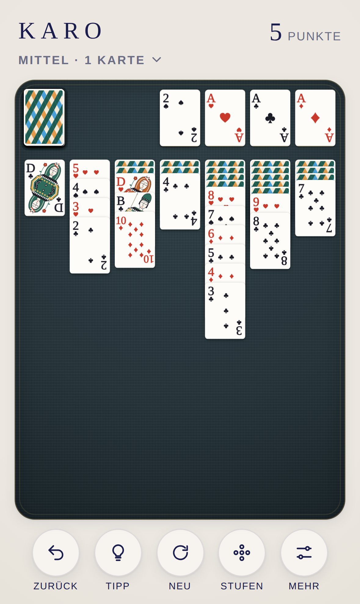
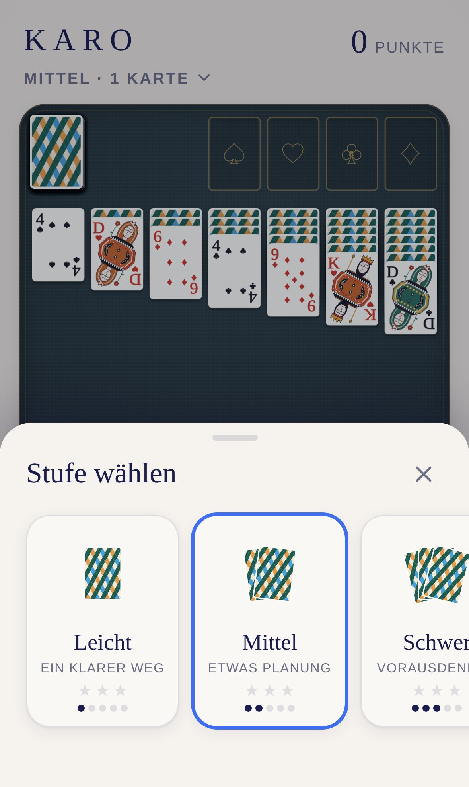
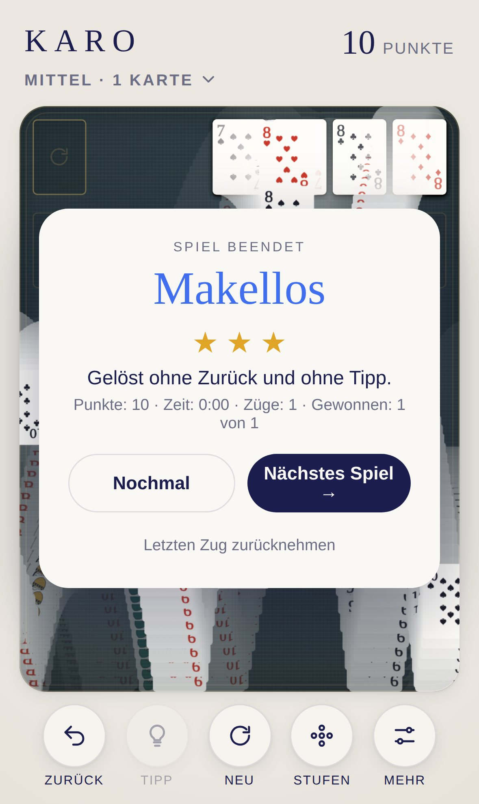

<div align="center">

# KARO

**Die klassische Patience für iPhone und iPad.**

52 Karten. Sieben Spalten. Vier Ablagen. Wie früher bei Windows, nur schöner.

[**▶ Jetzt spielen**](https://michaeldobner.github.io/mindpause/karo/) · [English](README.md) · [Dokumentation](docs/de/README.md) · [Changelog](CHANGELOG.de.md)

Ein Spiel der Sammlung [MIND PAUSE](../README.de.md).

[](https://github.com/michaeldobner/mindpause/actions/workflows/tests.yml)

&nbsp;&nbsp;
&nbsp;&nbsp;


</div>

## Warum KARO

KARO ist Klondike, die Patience, die mit Windows berühmt wurde. Gespielt wird mit einem eigens gestalteten Kartendeck im Stil klassischer Designer-Decks: reinweißes Papier, feine Didot-Indizes, zwölf große, diagonal liegende Bildkarten mit Musterbändern und geschlossenen Augen, Harlekin-Rauten auf der Rückseite. Die Karten liegen auf einer dunklen Leinenmatte mit Goldprägung. Keine Werbung, kein Konto, kein Tracking. Läuft im Browser, lässt sich wie eine App installieren und funktioniert offline.

## Highlights

| | |
|---|---|
| **1 oder 3 Karten** | Ziehen wie bei Windows: eine Karte (entspannt) oder drei Karten (anspruchsvoll) |
| **Punkte wie bei Windows** | Punkte für jeden Zug, Abzug für Zeit und Durchgänge, Zeitbonus beim Sieg |
| **Vegas** | 52 Einsatz, 5 je Karte auf einer Ablage, begrenzte Durchgänge, fortlaufendes Konto |
| **Stufen, die halten, was sie versprechen** | Leicht, Mittel, Schwer, Meisterhaft: jede Verteilung ist vorab geprüft und sicher lösbar |
| **Tagesspiel und Zufall** | Ein Spiel pro Tag, für alle gleich. Oder echter Zufall, danach verrät KARO, ob es lösbar war |
| **Tippen genügt** | Eine Karte antippen und sie springt an den besten Platz. Ziehen geht auch |
| **Tipps** | Ein Löser kennt den Weg und zeigt den nächsten richtigen Zug |
| **Siegesfeier** | Die springenden Karten von Windows, als ruhige Hommage mit verblassenden Spuren |
| **Klangdesign** | Papier auf Leinen: Schnippen, Gleiten, Auflegen. Auf den Ablagen der Keramikton der Sammlung |
| **Für Apple-Geräte gemacht** | iPhone hoch und quer, iPad mit Seitenleiste, Hell- und Dunkelmodus, respektiert den Lautlos-Schalter |

## So wird gespielt

1. In den **Spalten** wird absteigend und abwechselnd rot und schwarz angelegt, zum Beispiel die Herz 9 auf die Pik 10.
2. Auf eine **leere Spalte** passt nur ein König.
3. Auf den **Ablagen** wird je Farbe vom Ass bis zum König gesammelt.
4. Der **Stapel** liefert neue Karten, 1 oder 3 auf einmal.

**Ziel:** alle 52 Karten auf die Ablagen. Alle Regeln, Punkte und Stufen: [Spielregeln](docs/de/spielregeln.md).

## Auf iPhone oder iPad installieren

1. **https://michaeldobner.github.io/mindpause/karo/** in **Safari** öffnen.
2. Auf **Teilen** tippen, dann **Zum Home-Bildschirm**.
3. Fertig. KARO startet im Vollbild wie eine App und funktioniert auch ohne Internet.

## Dokumentation

| Dokument | Inhalt |
|---|---|
| [Spielregeln](docs/de/spielregeln.md) | Regeln, Ziehmodus, Punkte, Vegas, Stufen, Sterne, Bedienung |
| [Stufen](docs/de/stufen.md) | Wie aus zufälligem Mischen verlässliche Schwierigkeitsstufen werden |
| [Design-System](docs/de/design.md) | Kartendeck, Farben, Typografie, Matte, Layouts, Bewegung, Klang |
| [Architektur](docs/de/architektur.md) | Module, Datenmodell, Löser, Ablauf eines Zugs, Entwicklung und Tests |

## Schnellstart für Entwicklung

Aus dem Hauptordner des Repositorys:

```bash
npm start       # lokaler Server, dann http://localhost:3000/karo/ öffnen
npm test        # Logik-Tests der ganzen Sammlung
npm run e2e     # Browser-Test auf iPhone und iPad
```

Keine Abhängigkeiten, kein Build-Schritt. Alles, was KARO mit den anderen Spielen teilt, kommt aus der [Hülle](../shared/README.de.md).

## Technik

| Bereich | Umsetzung |
|---|---|
| Sprache | HTML, CSS, JavaScript (ES-Module) |
| Karten | SVG-Symbole, einmal angelegt, von jeder Karte mit `<use>` eingebunden |
| Bewegung | 52 HTML-Elemente, nur per `transform` bewegt, 3D-Drehung beim Aufdecken |
| Siegesfeier | Canvas mit verblassenden Spuren |
| Klang | Web Audio API, live erzeugt, keine Audiodateien |
| Tipps | Löser mit Tiefensuche in einem Web Worker |
| Stufen | Vorab eingeteilte Spielnummern (`tools/deals.mjs`) |
| Offline | Eigener Service Worker und Web App Manifest |
| Tests | Node.js Test-Runner und Playwright-Browser-Test, bei jedem Push |

## Ordnerstruktur

```
karo/
├─ index.html              Einstiegsseite, lädt die Hülle und KARO
├─ css/karo.css            Matte, Karten, Ablagen, Siegesfeier
├─ js/
│  ├─ main.js              verbindet KARO mit der Hülle
│  ├─ strings.js           Texte auf Deutsch und Englisch
│  ├─ cards.js             Karten, Zufall mit Startwert, Geben
│  ├─ game.js              Spiellogik, Punkte, Zurück
│  ├─ solver.js            Löser für Tipps und Stufen
│  ├─ solver-worker.js     rechnet den Löser im Hintergrund
│  ├─ levels.js            Stufen, nächste Spielnummer, Tagesspiel
│  ├─ deals.js             eingeteilte Spielnummern (erzeugt)
│  ├─ faces.js             das Kartendeck als SVG
│  ├─ view.js              Matte, Layout, Tippen und Ziehen, Animationen
│  ├─ celebrate.js         Siegesfeier
│  └─ sound.js             Klänge, auf der Klang-Engine der Hülle
├─ tools/
│  ├─ deals.mjs            teilt Spielnummern in Stufen ein
│  ├─ player.mjs           einfacher Spieler zum Einteilen
│  └─ icons.mjs            erzeugt die App-Symbole
├─ icons/                  App-Symbole
├─ sw.js                   Offline-Betrieb
├─ manifest.webmanifest    Installation als App
├─ tests/                  automatische Tests
└─ docs/                   Dokumentation (de, en, Bilder)
```

## Version

Aktuelle Version: **1.0.0**. Siehe [Changelog](CHANGELOG.de.md).
