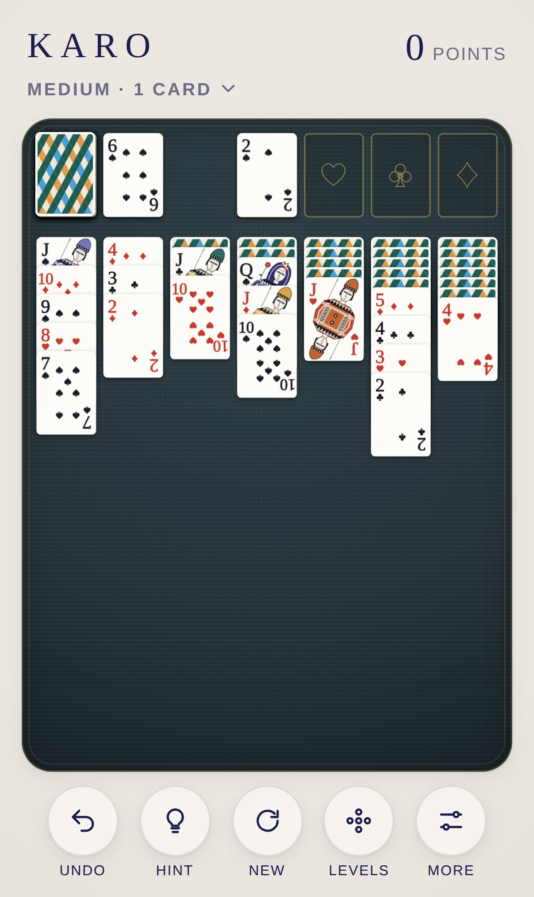

<div align="center">

# KARO

**Classic solitaire for iPhone and iPad.**

52 cards. Seven columns. Four foundations. Just like Windows used to have, only more beautiful.

[**▶ Play now**](https://michaeldobner.github.io/mindpause/karo/) · [Deutsch](README.de.md) · [Documentation](docs/en/README.md) · [Changelog](CHANGELOG.md)

Part of the [MIND PAUSE](../README.md) collection.

[](https://github.com/michaeldobner/mindpause/actions/workflows/tests.yml)

&nbsp;&nbsp;
&nbsp;&nbsp;


</div>

## Why KARO

KARO is Klondike, the solitaire that became famous with Windows. It is played with a deck designed just for it, in the style of classic designer decks: pure white paper, delicate Didot indices, twelve large diagonal court cards with patterned bands and a lowered gaze, harlequin diamonds on the back. The cards lie on a dark linen mat with gold embossing. No ads, no account, no tracking. Runs in the browser, installs like an app and works offline.

## Highlights

| | |
|---|---|
| **Draw one or three** | Like Windows: draw one card (relaxed) or three cards (demanding) |
| **Windows scoring** | Points for every move, deductions for time and passes, time bonus on a win |
| **Vegas** | 52 stake, 5 per card on a foundation, limited passes, running bank |
| **Levels you can trust** | Easy, Medium, Hard, Masterful: every deal is checked in advance and can be solved |
| **Daily deal and Random** | One deal per day, the same for everyone. Or true randomness, and afterwards KARO tells you whether it was solvable |
| **Just tap** | Tap a card and it jumps to the best place. Dragging works too |
| **Hints** | A solver knows the way and shows the next right move |
| **Win celebration** | The bouncing cards of Windows, as a calm homage with fading trails |
| **Sound design** | Paper on linen: flicks, slides, placements. On the foundations, the ceramic tone of the collection |
| **Made for Apple devices** | iPhone portrait and landscape, iPad with sidebar, light and dark mode, respects the silent switch |

## How to play

1. In the **columns**, build down in alternating colours, for example the 9 of hearts on the 10 of spades.
2. Only a king fits on an **empty column**.
3. On the **foundations**, collect each suit from ace to king.
4. The **stock** deals new cards, one or three at a time.

**Goal:** all 52 cards on the foundations. All rules, scoring and levels: [Gameplay](docs/en/gameplay.md).

## Install on iPhone or iPad

1. Open **https://michaeldobner.github.io/mindpause/karo/** in **Safari**.
2. Tap **Share**, then **Add to Home Screen**.
3. Done. KARO starts full screen like an app and works without internet.

## Documentation

| Document | Contents |
|---|---|
| [Gameplay](docs/en/gameplay.md) | Rules, draw mode, scoring, Vegas, levels, stars, controls |
| [Levels](docs/en/levels.md) | How random shuffling becomes reliable difficulty levels |
| [Design system](docs/en/design.md) | Deck, colours, typography, mat, layouts, motion, sound |
| [Architecture](docs/en/architecture.md) | Modules, data model, solver, flow of a move, development and tests |

## Quick start for development

From the repository root:

```bash
npm start       # local server, then open http://localhost:3000/karo/
npm test        # logic tests of the whole collection
npm run e2e     # browser test on iPhone and iPad
```

No dependencies, no build step. Everything KARO shares with the other games comes from the [shell](../shared/README.md).

## Version

Current version: **1.0.0**. See the [changelog](CHANGELOG.md).
