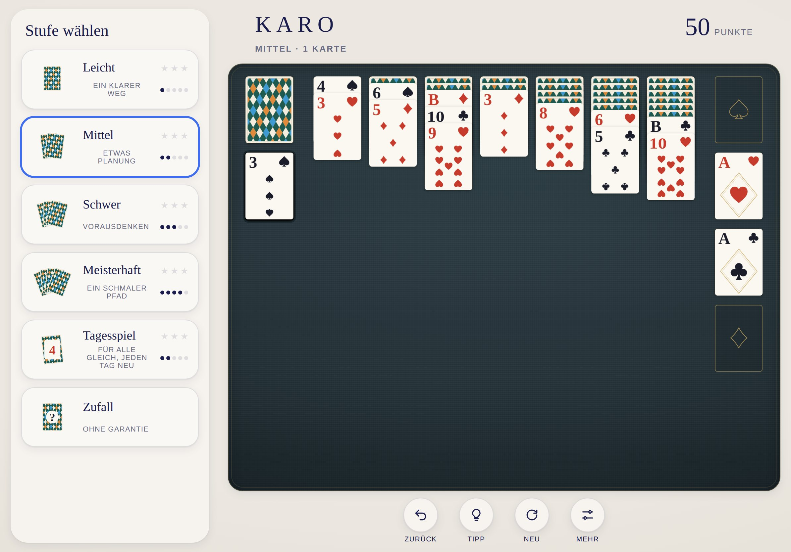

# KARO · Documentation

[Deutsche Version](../de/README.md) · [Back to the game](../../README.md)

| Document | Contents | For |
|---|---|---|
| [Gameplay](gameplay.md) | Rules, draw mode, scoring, Vegas, levels, stars, controls | Everyone |
| [Levels](levels.md) | How random shuffling becomes reliable difficulty levels | Everyone, development |
| [Design system](design.md) | Deck, colours, typography, mat, layouts, motion, sound | Design, development |
| [Architecture](architecture.md) | Modules, data model, solver, flow of a move, development and tests | Development |

## KARO at a glance

| | |
|---|---|
| Game | Klondike solitaire, as on Windows |
| Contents | Draw one or three, Windows or Vegas scoring, six levels, hints, stars, statistics |
| Platform | Progressive web app for iPhone and iPad, runs in any modern browser |
| Languages | German and English, chosen automatically |
| Technology | HTML, CSS, JavaScript modules, SVG, Canvas, Web Audio, no framework, no build step |
| Collection | Part of [MIND PAUSE](../../../README.md), interface from the [shell](../../../shared/README.md) |
| Address | https://michaeldobner.github.io/mindpause/karo/ |
| Version | 1.0.0 |

