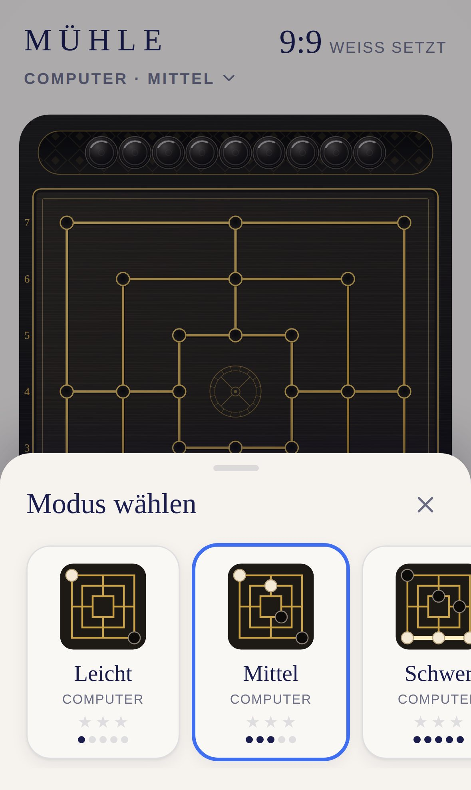
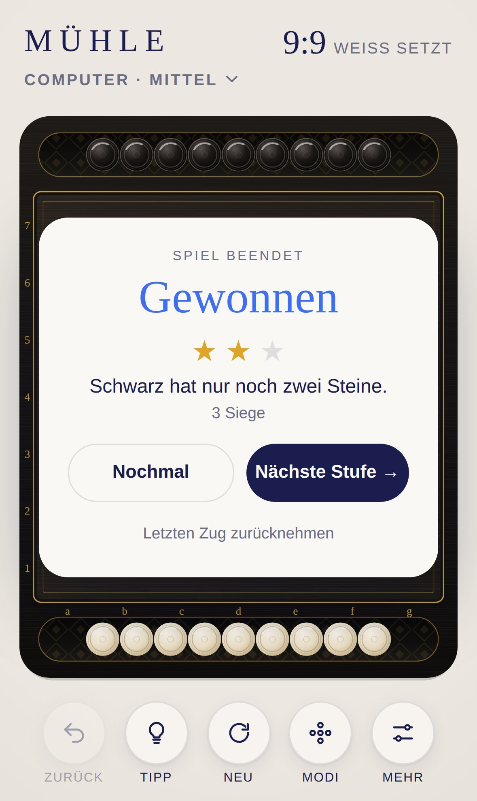

<div align="center">

# MÜHLE

**Neun Männer Mühle für iPhone und iPad.**

Gegen den Computer in drei Stufen oder zu zweit an einem Gerät. Setzen, ziehen, springen: Wer drei Steine in eine Reihe bringt, schließt eine Mühle und nimmt einen Stein.

[**▶ Jetzt spielen**](https://michaeldobner.github.io/mindpause/muehle/) · [English](README.md) · [Dokumentation](docs/de/README.md) · [Changelog](CHANGELOG.de.md)

Ein Spiel der Sammlung [MIND PAUSE](../README.de.md).

[](https://github.com/michaeldobner/mindpause/actions/workflows/tests.yml)

&nbsp;&nbsp;
&nbsp;&nbsp;


</div>

## Warum MÜHLE

MÜHLE ist das älteste Brettspiel der Sammlung und teilt sich die Werkstatt mit [QUEEN](../queen/README.de.md): schwarzes Holz, Steine in Elfenbein und Ebenholz, feines Gold. Die Linien des Bretts sind als Goldadern eingelegt, die 24 Punkte sind kleine vergoldete Mulden, in der Mitte liegt ein graviertes Mühlrad. Schließt jemand eine Mühle, leuchtet die Linie auf. Wer seine Steine noch setzen muss, findet sie in der eigenen Schale, genommene Steine rollen dazu. Wer es lieber farbig mag, wählt das tiefblaue Brett Mitternacht. Keine Werbung, kein Konto, offline spielbar.

## Highlights

| | |
|---|---|
| **Turnierregeln** | 9 Steine je Seite, Setzen, Ziehen, Springen mit drei Steinen, Schutz für Steine in Mühlen, Doppelmühle nimmt einen Stein |
| **Drei Computerstufen** | Leicht, Mittel, Schwer. Der Computer rechnet im Hintergrund, die Oberfläche bleibt flüssig |
| **Zu zweit** | Zwei Personen an einem Gerät, auf Wunsch dreht sich das Brett nach jedem Zug |
| **Leuchtende Mühle** | Eine geschlossene Mühle zieht eine Goldlinie nach, dazu ein Glockenton. Die Steine zum Nehmen pulsieren |
| **Schalen als Vorrat** | Die Steine zum Setzen liegen in der eigenen Schale und fliegen von dort aufs Brett. Antippen, wischen, neigen |
| **Zwei Brettstile** | Klassik mit Goldlinien und Koordinaten a bis g, 1 bis 7 oder Mitternacht in Tiefblau |
| **Tipps** | Der Computer zeigt den besten Zug und nach einer Mühle den besten Stein zum Nehmen |
| **Sterne** | Bis zu drei Sterne pro Stufe, je nach Zahl der Siege |
| **Zweisprachig** | Deutsch auf deutsch eingestellten Geräten, sonst Englisch |
| **Für Apple-Geräte gemacht** | iPhone hoch und quer, iPad mit Seitenleiste, Hell- und Dunkelmodus |

## So wird gespielt

1. **Setzen:** Weiß beginnt. Abwechselnd setzt jede Seite einen ihrer neun Steine auf einen freien Punkt.
2. **Ziehen:** Sind alle Steine gesetzt, zieht man einen Stein entlang einer Linie auf einen freien Nachbarpunkt.
3. **Springen:** Wer nur noch drei Steine hat, darf auf jeden freien Punkt springen.
4. **Mühle:** Drei eigene Steine in einer Linie sind eine Mühle. Dann nimmt man der Gegenseite einen Stein, der nicht in einer Mühle steht.
5. **Ende:** Wer nur noch zwei Steine hat oder nicht mehr ziehen kann, hat verloren.

Alle Regeln, Remis, Bedienung und Tipps: [Spielregeln](docs/de/spielregeln.md).

## Auf iPhone oder iPad installieren

1. **https://michaeldobner.github.io/mindpause/muehle/** in **Safari** öffnen.
2. Auf **Teilen** tippen, dann **Zum Home-Bildschirm**.
3. Fertig. MÜHLE startet im Vollbild wie eine App und funktioniert auch ohne Internet.

## Dokumentation

| Dokument | Inhalt |
|---|---|
| [Spielregeln](docs/de/spielregeln.md) | Regeln nach dem Weltmühlespiel-Dachverband, Modi, Remis, Bedienung, Schalen, Einstellungen |
| [Design](docs/de/design.md) | Brett, Linien, Mühlrad, Steine, Schalen, Layouts, Bewegung, Klänge |
| [Architektur](docs/de/architektur.md) | Module, Regeln, Computergegner, Ablauf eines Zugs, Tests |

## Schnellstart für Entwicklung

Aus dem Hauptordner des Repositorys:

```bash
npm start       # lokaler Server, dann http://localhost:3000/muehle/ öffnen
npm test        # Logik-Tests der ganzen Sammlung
npm run e2e     # Browser-Test auf iPhone und iPad
```

Keine Abhängigkeiten, kein Build-Schritt. Alles, was MÜHLE mit den anderen Spielen teilt, kommt aus der [Hülle](../shared/README.de.md).

## Ordnerstruktur

```
muehle/
├─ index.html              Einstiegsseite, lädt die Hülle und MÜHLE
├─ css/muehle.css          nur Zielringe, Steine zum Nehmen und Vorschau der Modi
├─ js/
│  ├─ main.js              verbindet MÜHLE mit der Hülle, Modi, Computerzüge
│  ├─ strings.js           Texte auf Deutsch und Englisch
│  ├─ rules.js             Regeln der Mühle
│  ├─ game.js              Spielstand, Vorrat, Zurück, Spielende, Remis
│  ├─ ai.js                Computergegner
│  ├─ ai-worker.js         rechnet den Computer im Hintergrund
│  ├─ themes.js            Brettstile Klassik und Mitternacht, Mühlrad
│  ├─ view.js              Brett, Steine, Mühlen, Schalen, Eingabe
│  └─ sound.js             Klänge von MÜHLE
├─ icons/                  App-Symbole
├─ tools/                  Symbole und Bilder der Dokumentation erzeugen
├─ sw.js                   Offline-Betrieb
├─ manifest.webmanifest    Installation als App
├─ tests/                  automatische Tests
└─ docs/                   Dokumentation (de, en, Bilder)
```

## Version

Aktuelle Version: **1.0.0**. Siehe [Changelog](CHANGELOG.de.md).
