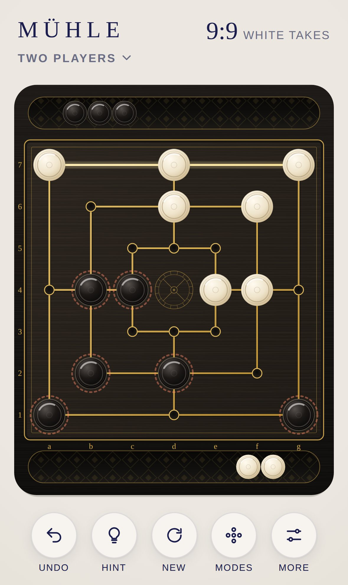
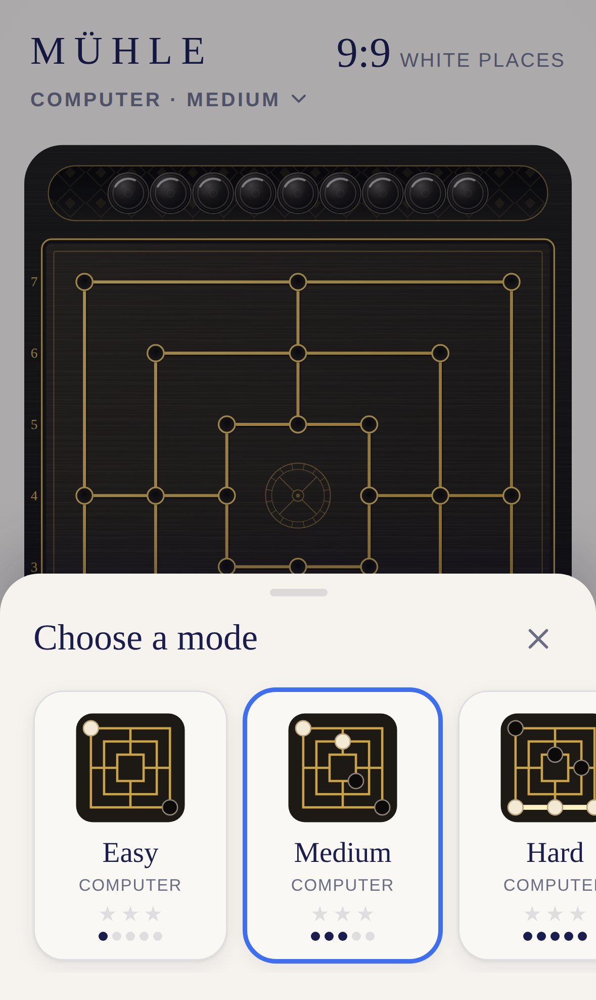

<div align="center">

# MÜHLE

**Nine men's morris for iPhone and iPad.**

Against the computer on three levels or for two players on one device. Place, move, fly: line up three pieces to close a mill and take a piece.

[**▶ Play now**](https://michaeldobner.github.io/mindpause/muehle/) · [Deutsch](README.de.md) · [Documentation](docs/en/README.md) · [Changelog](CHANGELOG.md)

A game of the [MIND PAUSE](../README.md) collection.

[](https://github.com/michaeldobner/mindpause/actions/workflows/tests.yml)

&nbsp;&nbsp;


</div>

## Why MÜHLE

MÜHLE (German for "mill") is the oldest board game of the collection and shares its workshop with [QUEEN](../queen/README.md): black wood, ivory and ebony pieces, fine gold. The lines of the board are inlaid gold, the 24 points are small gilded hollows, and an engraved mill wheel sits in the middle. When a mill is closed, its line lights up. The pieces you still have to place wait in your own tray, taken pieces roll in next to them. If you prefer colour, choose the deep blue Midnight board. No ads, no account, works offline.

## Highlights

| | |
|---|---|
| **Tournament rules** | 9 pieces each, placing, moving, flying with three pieces, pieces in mills are protected, a double mill takes one piece |
| **Three computer levels** | Easy, Medium, Hard. The computer thinks in the background, the interface stays smooth |
| **Two players** | Two people on one device, optionally the board turns after every move |
| **Glowing mill** | A closed mill draws a line of gold with a bell tone. The pieces you may take pulse |
| **Trays as supply** | The pieces to place lie in your own tray and fly onto the board from there. Tap, swipe, tilt |
| **Two board styles** | Classic with gold lines and coordinates a to g, 1 to 7, or Midnight in deep blue |
| **Hints** | The computer shows the best move, and after a mill the best piece to take |
| **Stars** | Up to three stars per level, depending on the number of wins |
| **Bilingual** | German on devices set to German, English otherwise |
| **Made for Apple devices** | iPhone and iPad in portrait and landscape, full height board in landscape, light and dark mode |

## How to play

1. **Place:** White begins. Taking turns, each side places one of its nine pieces on a free point.
2. **Move:** Once all pieces are placed, move a piece along a line to a free neighbouring point.
3. **Fly:** A side with only three pieces left may jump to any free point.
4. **Mill:** Three of your pieces in one line form a mill. Then take one opposing piece that is not part of a mill.
5. **End:** A side with only two pieces left, or with no move, loses.

All rules, draws, controls and tips: [Gameplay](docs/en/gameplay.md).

## Install on iPhone or iPad

1. Open **https://michaeldobner.github.io/mindpause/muehle/** in **Safari**.
2. Tap **Share**, then **Add to Home Screen**.
3. Done. MÜHLE starts full screen like an app and also works offline.

## Documentation

| Document | Content |
|---|---|
| [Gameplay](docs/en/gameplay.md) | Rules of the World Mill Federation, modes, draws, controls, trays, settings |
| [Design](docs/en/design.md) | Board, lines, mill wheel, pieces, trays, layouts, motion, sounds |
| [Architecture](docs/en/architecture.md) | Modules, rules, computer opponent, flow of a move, tests |

## Development quick start

From the repository root:

```bash
npm start       # local server, then open http://localhost:3000/muehle/
npm test        # logic tests of the whole collection
npm run e2e     # browser test on iPhone and iPad
```

No dependencies, no build step. Everything MÜHLE shares with the other games comes from the [shell](../shared/README.md).

## Version

Current version: **1.0.0**. See [Changelog](CHANGELOG.md).
