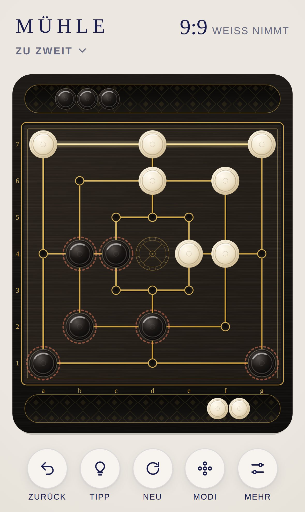
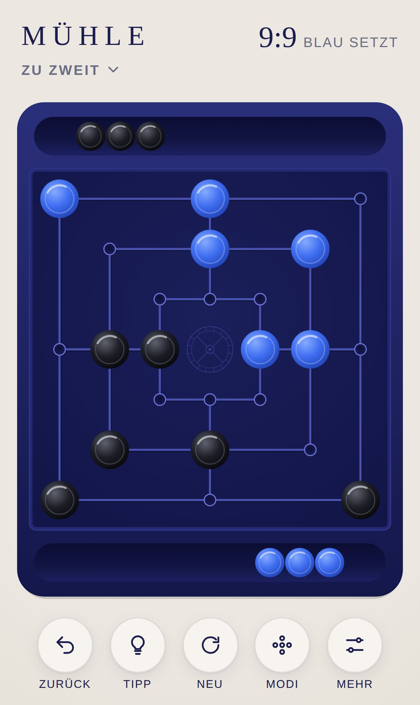
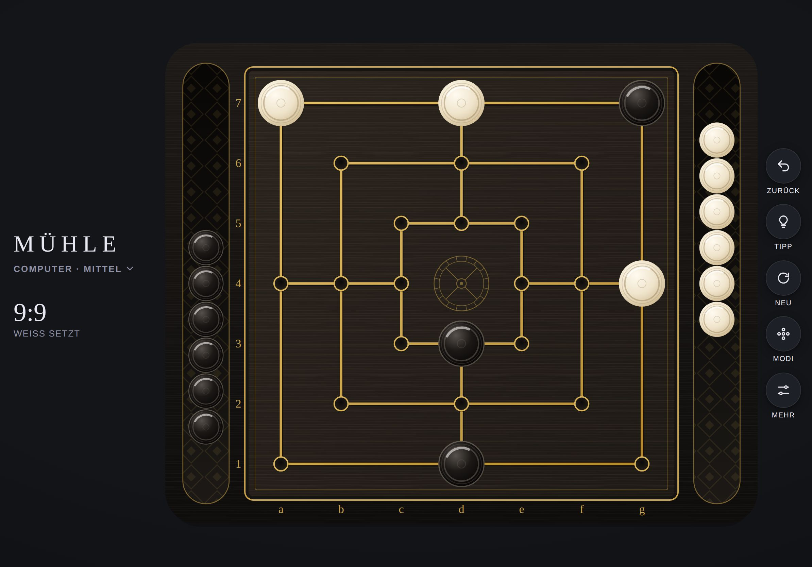

# MÜHLE · Dokumentation

[English version](../en/README.md) · [Zurück zum Projekt](../../README.de.md)

| Dokument | Inhalt | Für wen |
|---|---|---|
| [Spielregeln](spielregeln.md) | Regeln, Modi, Remis, Sterne, Bedienung, Schalen, Einstellungen | Alle |
| [Design](design.md) | Brettstile, Farben, Linien, Mühlrad, Steine, Schalen, Layouts, Bewegung, Klänge | Design, Entwicklung |
| [Architektur](architektur.md) | Module, Regelwerk, Spielstand, Computergegner, Darstellung, Ablauf eines Zugs, Tests | Entwicklung |

## MÜHLE auf einen Blick

| | |
|---|---|
| Spiel | Neun Männer Mühle, 24 Punkte, 9 Steine je Seite |
| Regeln | Turnierregeln des Weltmühlespiel-Dachverbands (WMD) |
| Modi | Computer Leicht, Mittel, Schwer sowie Zu zweit an einem Gerät |
| Inhalt | Zwei Brettstile, leuchtende Mühlen, Schalen als Vorrat, Tipps, Zurück, Sterne und Statistik je Modus |
| Plattform | Progressive Web App für iPhone und iPad, läuft in jedem modernen Browser |
| Sprachen | Deutsch und Englisch, automatisch nach Gerätesprache |
| Technik | HTML, CSS, JavaScript-Module, SVG, Web Audio, Web Worker, kein Framework, kein Build-Schritt |
| Sammlung | Teil von [MIND PAUSE](../../../README.de.md), Oberfläche aus der [Hülle](../../../shared/README.de.md), Gestaltung von [QUEEN](../../../queen/README.de.md) |
| Adresse | https://michaeldobner.github.io/mindpause/muehle/ |
| Version | 1.0.0 |

&nbsp;

