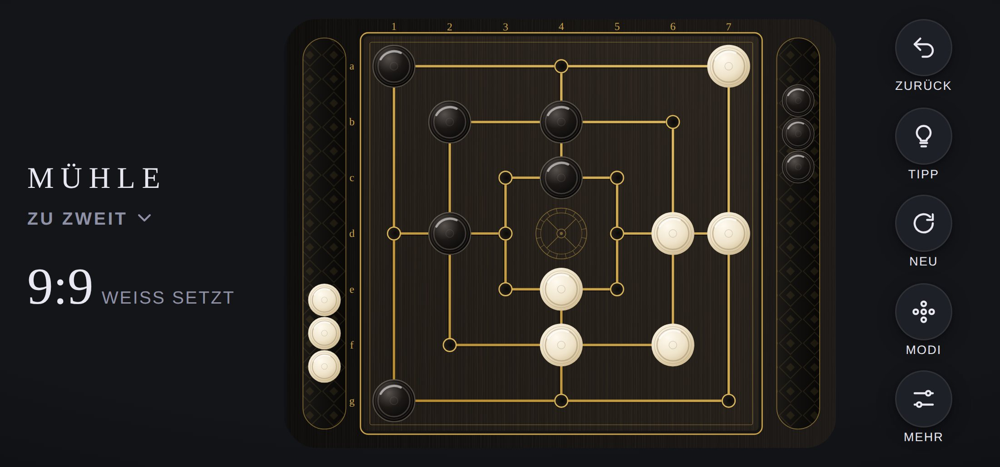

# Design

[English version](../en/design.md) · [Übersicht](README.md)

## Leitidee

MÜHLE ist ein Geschwister von [QUEEN](../../../queen/docs/de/design.md): dieselbe Werkstatt, dieselben Materialien. Schwarzes Holz, Elfenbein, Ebenholz und feines Gold, und Gold ist nie Fläche, sondern Linie. Beim Mühlebrett passt das besonders gut, denn das Brett **ist** Linie: Die drei Quadrate und vier Querlinien liegen als Goldadern im Holz. Jede Bewegung erklärt, was passiert: welcher Stein gesetzt wird, welcher zieht, welche Mühle sich schließt, welcher Stein genommen wird.

Schriften, Oberflächenfarben und alle Bausteine der Oberfläche kommen aus der [Hülle](../../../shared/README.de.md). Dieses Dokument beschreibt nur, was MÜHLE eigen ist.

## Brettstile

Wählbar unter **Mehr > Brett**. Ein Stil ist nur ein Satz Farben und Muster in `js/themes.js`, ein Wechsel blendet weich über, das Spiel läuft weiter.

| | Klassik (Standard) | Mitternacht |
|---|---|---|
| Wirkung | Schwarzes Holz mit Goldeinlage | Ruhiges, tiefblaues Lackbrett |
| Seiten | Weiß (Elfenbein) unten, Schwarz (Ebenholz) oben | Blau unten, Schwarz oben |
| Linien | Gold mit feiner Schattenlinie, wirkt eingelegt | Helles Blau |
| Koordinaten | a bis g und 1 bis 7 in Gold | keine |

&nbsp;&nbsp;

## Farben im Stil Klassik

| Element | Farben | Wirkung |
|---|---|---|
| Brettplatte | Verlauf `#1d1a17` nach `#0f0d0c`, feine Maserung | Mattes schwarzes Holz, wie QUEEN |
| Spielfeld | Verlauf `#2a241e` nach `#1d1915`, warme Maserung | Die dunklen Felder von QUEEN als ganze Fläche |
| Linien | Verlauf `#e3c06a` nach `#b68a2e`, darunter eine Schattenlinie | Eingelegte Goldader |
| Punkte | Mulde von `#0b0a09` nach `#2a241e`, Goldring `#d9b45a` | Kleine vergoldete Vertiefung |
| Mühlrad | Gold `#c9a24a` mit halber Deckkraft | Gravur in der Mitte |
| Leuchtende Mühle | `#fff1c4` nach `#e8c25c`, breiter Schein darunter | Helles Gold, deutlich heller als die Linien |
| Steine | Elfenbein und Ebenholz wie bei QUEEN | Gedrechseltes Holz mit Ringen |

**Ebenholz auf dunklem Holz** bleibt wie bei QUEEN gut sichtbar: Das Feld ist ein warmes Braunschwarz, die Steine haben Glanz und einen feinen hellen Rand und werfen einen weichen Schatten.

## Das Mühlrad

In der Mitte des inneren Quadrats, wo nie ein Stein steht, liegt ein graviertes **Mühlrad**: Nabe, acht Speichen und ein Kranz mit sechzehn Schaufeln. Es ist das Gegenstück zur Krone von QUEEN, erzeugt aus Code in `millWheel()` in `js/themes.js`.

## Steine

Gedrechselte Steine wie bei QUEEN, ohne Krone, dafür mit einer kleinen Mittelmulde. Zwei Drechselringe, ein Glanzlicht oben links und ein Schatten, der beim Anheben wandert. Eine innere Gruppe dreht jeden Stein gegen das Brett, das Licht fällt deshalb in jeder Ausrichtung von oben links.

## Geometrie

Brettraum 1000 × 1280 Einheiten im Hochformat, im Querformat eine breite Platte von 1280 × 1040 Einheiten mit Schalen links und rechts, wie bei QUEEN.

| Größe | Wert | Begründung |
|---|---|---|
| Spielfeld | 920 × 920 ab (40, 180) | Füllt fast die ganze Breite |
| Raster | 7 × 7 Linien im Abstand 130, Rand 70 | Auf dem iPhone etwa 50 pt zwischen zwei Punkten |
| Stein | Radius 50 | Zwischen zwei Nachbarn bleibt ein sichtbarer Spalt |
| Tippfläche | Radius 64 um jeden Punkt | Deutlich über 44 pt |
| Stein in der Schale | Radius 38 | Eine Schale hält höchstens 9 Steine |
| Schalen | Mittellinie bei y = 1192 (Weiß) und y = 88 (Schwarz), Länge 880 | Wie bei QUEEN |

**Warum höchstens 9 Steine je Schale?** Mit jedem eigenen Zug verlässt ein Stein den Vorrat, und höchstens ein genommener kommt dazu. Nach dem Setzen ist der Vorrat leer, und mehr als 7 Steine kann niemand nehmen.

## Schalen

Wie bei QUEEN hat jede Seite eine Schale, aber mit doppelter Aufgabe: Darin liegen die **eigenen Steine zum Setzen** und die **Steine, die man genommen hat**. Beim Setzen fliegt ein Stein aus der Schale in einem Bogen aufs Brett und wächst dabei auf volle Größe. Die Physik der Hülle (`Gutter`) sorgt für Rollen, Stöße und Neigen.

## Bewegung

| Moment | Animation | Dauer |
|---|---|---|
| Stein auswählen | Hebt sich leicht an, Ziele erscheinen als gepunktete Ringe | sofort |
| Setzen | Bogen aus der Schale auf den Punkt, wächst auf volle Größe | 380 ms |
| Ziehen | Kleiner Bogen zum Nachbarpunkt | 260 ms |
| Springen | Höherer Bogen | 380 ms |
| Losgelassener Stein | Gleitet ohne Bogen ins Ziel | 160 ms |
| Mühle | Goldlinie zieht sich von einem Ende zum anderen, mit Schein | 320 ms |
| Steine zum Nehmen | Gestrichelter Ring in Korallrot `#ff8a6b`, pulsiert | bis zur Wahl |
| Stein genommen | Hebt sich an und rollt in die Schale der nehmenden Seite | 160 ms und 420 ms |
| Neu, Zurück, Moduswechsel | Jeder Stein gleitet an seinen Platz, auch zurück in die Schalen | 380 ms |

Animationen laufen über eine Warteschlange nacheinander.

## Layouts

| Situation | Anordnung |
|---|---|
| iPhone hoch | Schriftzug, Modus und Zähler oben, Brett mittig, fünf Schaltflächen unten |
| iPhone quer | Weiß bleibt unten, die Platte wird breiter, Schalen links (Schwarz) und rechts (Weiß), Schaltflächen rechts |
| iPad quer | Wie iPhone quer, das Brett nutzt die volle Höhe. Modi als Schublade von links |

## Klänge

Dieselbe Klang-Engine wie alle Spiele der Sammlung (`js/sound.js`).

| Moment | Klang |
|---|---|
| Anheben | Weiches Tippen |
| Setzen, Ziehen | Keramik auf Holz, wird mit dem Spielverlauf heller |
| Mühle | Zwei helle Glockentöne, bei einer Doppelmühle ein dritter |
| Nehmen | Kräftiges Holz mit tiefer Keramik |
| Schale | Rollen und Klicken der Steine |
| Ende | Dreiklang beim Sieg, zwei absteigende Töne bei einer Niederlage |

## App-Symbol

Gleiche Bildsprache wie die übrigen Symbole der Sammlung: kräftige Farbe ohne Rahmen, hier Petrol (`#1f6b73` nach `#0a2a2f`), Spielmaterial von oben, Licht von oben links. Darauf das Mühlebrett in Goldlinien, oben eine geschlossene Mühle aus drei Elfenbeinsteinen mit leuchtender Linie, dazu zwei Ebenholzsteine. Erzeugt mit `node muehle/tools/icons.mjs`.
