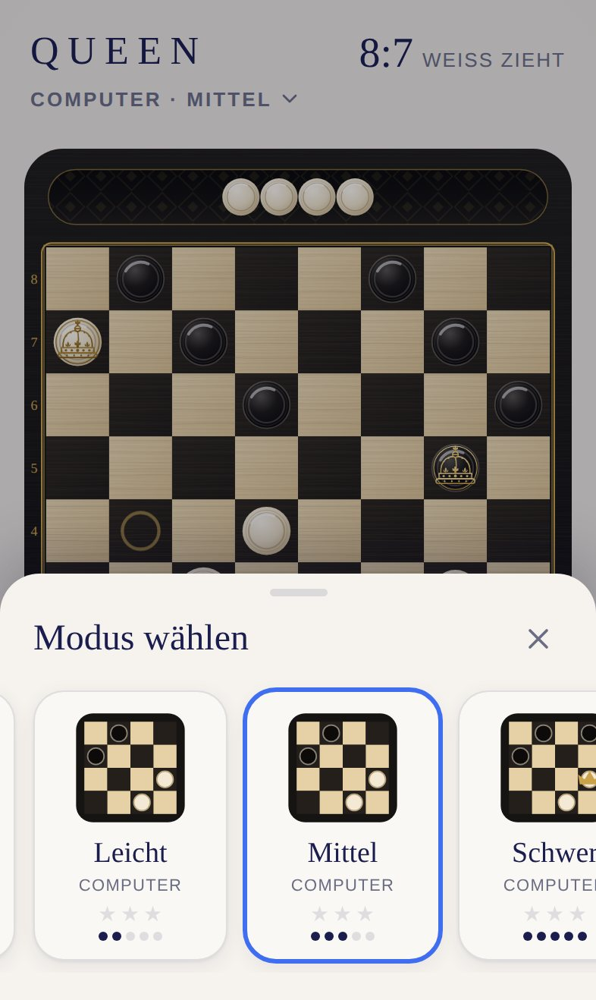
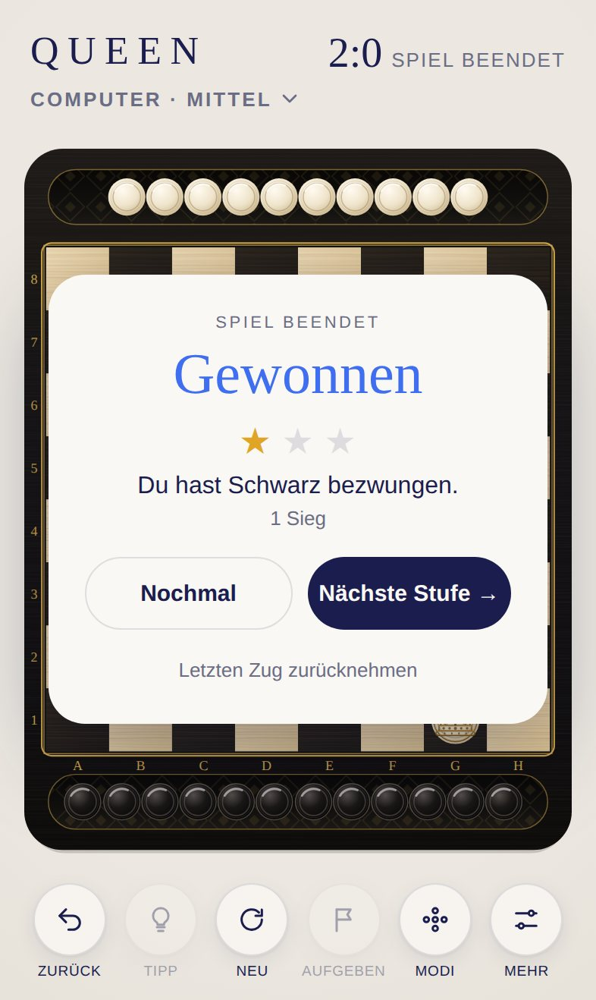

<div align="center">

# QUEEN

**Deutsche Dame für iPhone und iPad.**

Gegen den Computer in drei Stufen oder zu zweit an einem Gerät. Wer die gegnerische Grundreihe erreicht, wird gekrönt.

[**▶ Jetzt spielen**](https://michaeldobner.github.io/mindpause/queen/) · [English](README.md) · [Dokumentation](docs/de/README.md) · [Changelog](CHANGELOG.de.md)

Ein Spiel der Sammlung [MIND PAUSE](../README.de.md).

[](https://github.com/michaeldobner/mindpause/actions/workflows/tests.yml)

&nbsp;&nbsp;
&nbsp;&nbsp;


</div>

## Warum QUEEN

QUEEN bringt das klassische Damespiel in die ruhige Welt von MIND PAUSE: schwarzes Holz, Felder aus Ahorn und Ebenholz, Steine in Elfenbein und Ebenholz, feine Goldlinien und eine gravierte Goldkrone für jede Dame. Geschlagene Steine rollen in zwei Schalen. Wer es lieber farbig mag, wählt das tiefblaue Brett Mitternacht. Der Computergegner denkt wie ein Schachprogramm, die Klänge sind dieselben feinen Holz- und Keramikklänge wie bei SPRING. Keine Werbung, kein Konto, offline spielbar.

## Highlights

| | |
|---|---|
| **Deutsche Dame** | 8×8, Steine schlagen auch rückwärts, fliegende Damen, Schlagpflicht, Mehrfachschlag |
| **Drei Computerstufen** | Leicht, Mittel, Schwer. Der Computer rechnet im Hintergrund, die Oberfläche bleibt flüssig |
| **Zu zweit** | Zwei Personen an einem Gerät, auf Wunsch dreht sich das Brett nach jedem Zug |
| **Gravierte Krone** | Wer die Grundreihe erreicht, wird zur Dame: Eine Königinnenkrone in feiner Goldgravur erscheint, dazu ein Glockenton |
| **Zwei Brettstile** | Klassik mit Ebenholz, Ahorn und goldenen Koordinaten oder Mitternacht in Tiefblau |
| **Zwei Schalen** | Geschlagene Steine rollen in die Schale ihrer Gegenseite. Antippen, wischen, neigen |
| **Tipps** | Der Computer zeigt dir auf Wunsch den besten Zug |
| **Sterne** | Bis zu drei Sterne pro Stufe, je nach Zahl der Siege |
| **Zweisprachig** | Deutsch auf deutsch eingestellten Geräten, sonst Englisch |
| **Für Apple-Geräte gemacht** | iPhone hoch und quer, iPad mit Seitenleiste, Hell- und Dunkelmodus |

## So wird gespielt

1. Weiß beginnt (im Stil Mitternacht Blau). Steine ziehen ein Feld diagonal vorwärts.
2. Geschlagen wird, indem man über einen gegnerischen Stein auf das freie Feld dahinter springt, vorwärts wie rückwärts. **Schlagen ist Pflicht.**
3. Wer die gegnerische Grundreihe erreicht, wird zur Dame und zieht über beliebig viele freie Felder.
4. Wer nicht mehr ziehen kann, hat verloren.

Alle Regeln, Remis, Bedienung und Tipps: [Spielregeln](docs/de/spielregeln.md).

## Auf iPhone oder iPad installieren

1. **https://michaeldobner.github.io/mindpause/queen/** in **Safari** öffnen.
2. Auf **Teilen** tippen, dann **Zum Home-Bildschirm**.
3. Fertig. QUEEN startet im Vollbild wie eine App und funktioniert auch ohne Internet.

## Dokumentation

| Dokument | Inhalt |
|---|---|
| [Spielregeln](docs/de/spielregeln.md) | Regeln der Deutschen Dame, Modi, Bewertung, Bedienung, Schalen, Einstellungen |
| [Design](docs/de/design.md) | Brett, Steine, Krone, Schalen, Layouts, Bewegung |
| [Klangdesign](docs/de/klang.md) | Die Klänge von QUEEN auf der Klang-Engine der Hülle |
| [Architektur](docs/de/architektur.md) | Module, Regeln, Computergegner, Ablauf eines Zugs |
| [Entwicklung](docs/de/entwicklung.md) | Lokal starten, Tests, Konventionen |
| [Erweitern](docs/de/erweitern.md) | Stufen, Regeln, Spiel gegeneinander auf zwei Geräten |
| [Deployment](docs/de/deployment.md) | Adresse, Offline-Speicher, Fehlerbehebung |

## Schnellstart für Entwicklung

Aus dem Hauptordner des Repositorys:

```bash
npm start       # lokaler Server, dann http://localhost:3000/queen/ öffnen
npm test        # Logik-Tests der ganzen Sammlung
npm run e2e     # Browser-Test auf iPhone und iPad
```

Keine Abhängigkeiten, kein Build-Schritt. Alles, was QUEEN mit den anderen Spielen teilt (Oberfläche, Schriften, Farben, Klang-Engine, Physik der Schalen, Neigen, Sprachen, Offline-Betrieb), kommt aus der [Hülle](../shared/README.de.md).

## Ordnerstruktur

```
queen/
├─ index.html              Einstiegsseite, lädt die Hülle und QUEEN
├─ css/queen.css           nur Zielringe und Vorschau der Modi
├─ js/
│  ├─ main.js              verbindet QUEEN mit der Hülle, Modi, Computerzüge
│  ├─ strings.js           Texte von QUEEN auf Deutsch und Englisch
│  ├─ rules.js             Regeln der Deutschen Dame
│  ├─ game.js              Spielstand, Zurück, Spielende, Remis
│  ├─ ai.js                Computergegner
│  ├─ ai-worker.js         rechnet den Computer im Hintergrund
│  ├─ themes.js            Brettstile Klassik und Mitternacht, Kronengravur
│  ├─ view.js              Brett, Steine, Krone, Schalen, Eingabe
│  └─ sound.js             Klänge von QUEEN
├─ tools/
│  └─ icons.mjs            erzeugt die App-Symbole
├─ icons/                  App-Symbole
├─ sw.js                   Offline-Betrieb
├─ manifest.webmanifest    Installation als App
├─ tests/                  automatische Tests von QUEEN
└─ docs/                   Dokumentation (de, en, Bilder)
```

## Version

Aktuelle Version: **1.1.1**. Siehe [Changelog](CHANGELOG.de.md).
