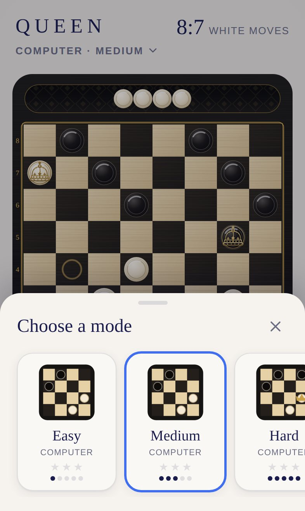
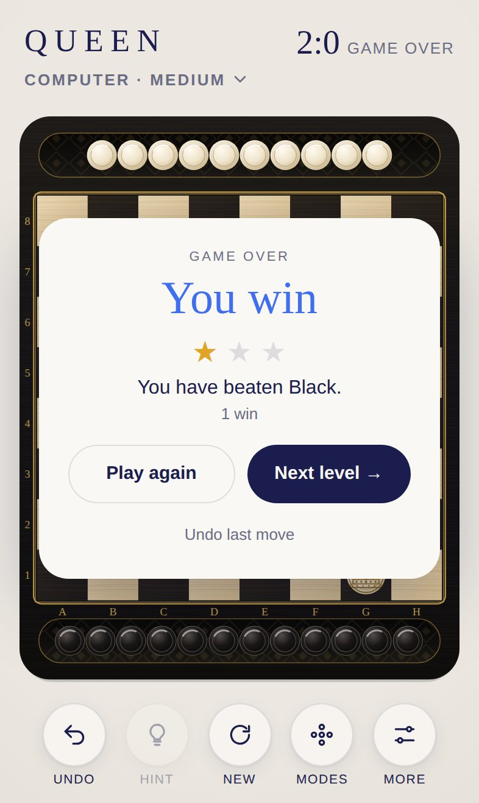

<div align="center">

# QUEEN

**German checkers for iPhone and iPad.**

Against the computer on three levels or for two players on one device. Reach the far row and be crowned.

[**▶ Play now**](https://michaeldobner.github.io/mindpause/queen/) · [Deutsch](README.de.md) · [Documentation](docs/en/README.md) · [Changelog](CHANGELOG.md)

A game of the [MIND PAUSE](../README.md) collection.

[](https://github.com/michaeldobner/mindpause/actions/workflows/tests.yml)

&nbsp;&nbsp;
&nbsp;&nbsp;


</div>

## Why QUEEN

QUEEN brings the classic game of checkers into the calm world of MIND PAUSE: black wood, squares of maple and ebony, pieces in ivory and ebony, fine gold lines and an engraved golden crown for every queen. Captured pieces roll into two trays. If you prefer colour, choose the deep blue Midnight board. The computer opponent thinks like a chess program, the sounds are the same fine wood and ceramic sounds as in SPRING. No ads, no account, playable offline.

## Highlights

| | |
|---|---|
| **German checkers** | 8×8, pieces also capture backwards, flying queens, mandatory capture, multiple captures |
| **Three computer levels** | Easy, Medium, Hard. The computer thinks in the background, the interface stays smooth |
| **Two players** | Two people on one device, optionally the board turns after every move |
| **Engraved crown** | Reach the far row and become a queen: a queen's crown in fine gold engraving appears, with a bell tone |
| **Two board styles** | Classic with ebony, maple and golden coordinates, or Midnight in deep blue |
| **Two trays** | Captured pieces roll into the tray of the side that captured them. Tap, swipe, tilt |
| **Hints** | On request the computer shows you the best move |
| **Stars** | Up to three stars per level, based on the number of wins |
| **Bilingual** | German on German devices, English everywhere else |
| **Made for Apple devices** | iPhone portrait and landscape, iPad with sidebar, light and dark mode |

## How to play

1. White moves first (Blue in the Midnight style). Pieces move one square diagonally forwards.
2. You capture by jumping over an opposing piece onto the empty square behind it, forwards or backwards. **Capturing is mandatory.**
3. A piece that reaches the far row becomes a queen and moves across any number of empty squares.
4. A player who cannot move loses.

All rules, draws, controls and tips: [Gameplay](docs/en/gameplay.md).

## Install on iPhone or iPad

1. Open **https://michaeldobner.github.io/mindpause/queen/** in **Safari**.
2. Tap **Share**, then **Add to Home Screen**.
3. Done. QUEEN opens full screen like an app and also works without internet.

## Documentation

| Document | Contents |
|---|---|
| [Gameplay](docs/en/gameplay.md) | Rules of German checkers, modes, scoring, controls, trays, settings |
| [Design](docs/en/design.md) | Board, pieces, crown, trays, layouts, motion |
| [Sound design](docs/en/sound.md) | QUEEN's sounds on the shell's sound engine |
| [Architecture](docs/en/architecture.md) | Modules, rules, computer opponent, flow of a move |
| [Development](docs/en/development.md) | Local setup, tests, conventions |
| [Extending](docs/en/extending.md) | Levels, rules, playing on two devices |
| [Deployment](docs/en/deployment.md) | Address, offline store, troubleshooting |

## Quick start for developers

From the main folder of the repository:

```bash
npm start       # local server, then open http://localhost:3000/queen/
npm test        # logic tests of the whole collection
npm run e2e     # browser test on iPhone and iPad
```

No dependencies, no build step. Everything QUEEN shares with the other games (interface, fonts, colours, sound engine, tray physics, tilt, languages, offline support) comes from the [shell](../shared/README.md).

## Folder structure

```
queen/
├─ index.html              entry page, loads the shell and QUEEN
├─ css/queen.css           only target rings and mode previews
├─ js/
│  ├─ main.js              connects QUEEN to the shell, modes, computer moves
│  ├─ strings.js           QUEEN texts in German and English
│  ├─ rules.js             rules of German checkers
│  ├─ game.js              game state, undo, end of game, draws
│  ├─ ai.js                computer opponent
│  ├─ ai-worker.js         runs the computer in the background
│  ├─ themes.js            Classic and Midnight board styles, crown engraving
│  ├─ view.js              board, pieces, crown, trays, input
│  └─ sound.js             QUEEN sounds
├─ icons/                  app icons
├─ sw.js                   offline support
├─ manifest.webmanifest    install as an app
├─ tests/                  QUEEN's automated tests
└─ docs/                   documentation (de, en, images)
```

## Version

Current version: **1.1.0**. See the [changelog](CHANGELOG.md).
