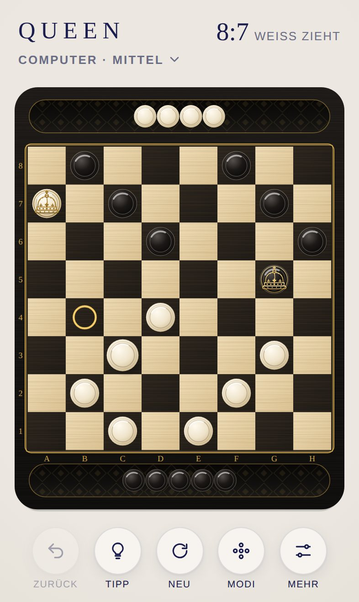
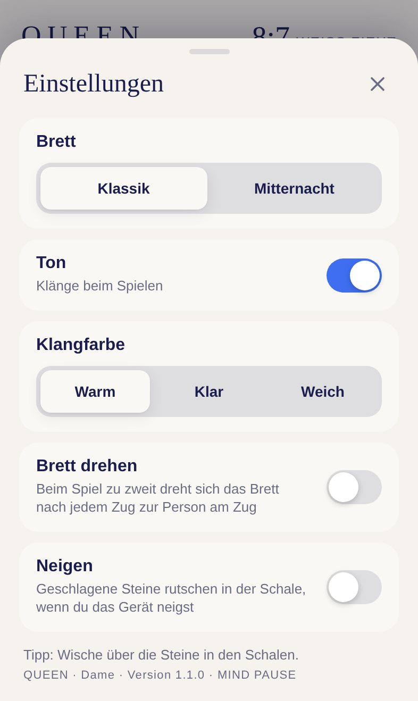
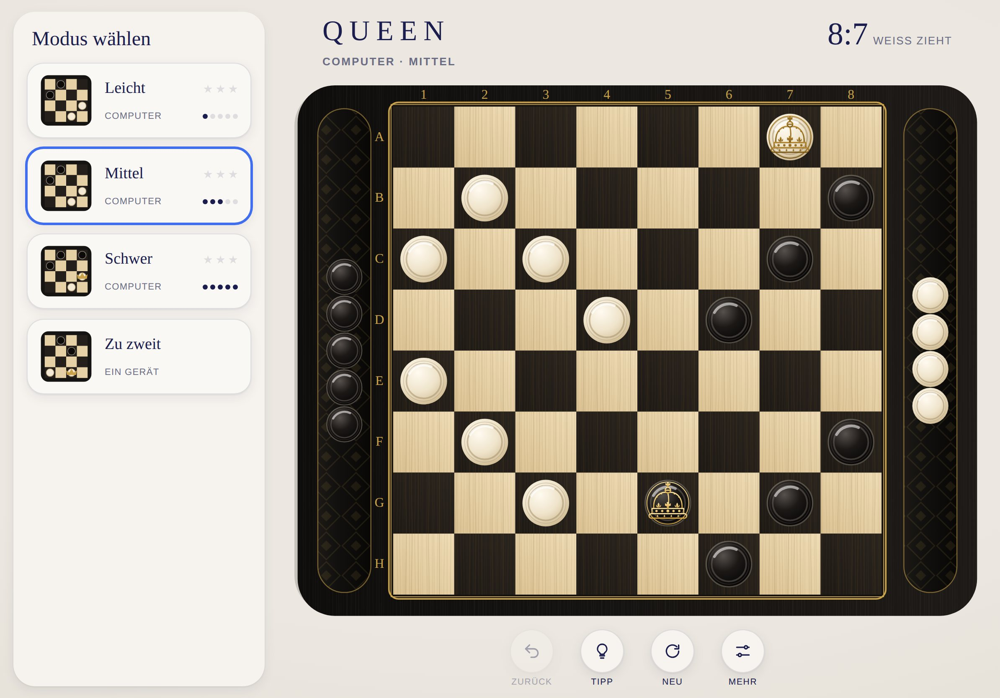

# QUEEN · Dokumentation

[English version](../en/README.md) · [Zurück zum Projekt](../../README.de.md)

Diese Dokumentation beschreibt QUEEN vollständig: wie man spielt, wie es aussieht und klingt, wie der Computergegner denkt, wie das Spiel aufgebaut ist und wie man es weiterentwickelt und veröffentlicht.

| Dokument | Inhalt | Für wen |
|---|---|---|
| [Spielregeln](spielregeln.md) | Regeln der Deutschen Dame, Modi, Remis, Sterne, Bedienung, Schalen, Einstellungen | Alle |
| [Design](design.md) | Brettstile Klassik und Mitternacht, Farben, Krone, Schalen, Ausrichtung, Layouts, Bewegung | Design, Entwicklung |
| [Klangdesign](klang.md) | Die Klänge von QUEEN auf der Klang-Engine der Hülle | Design, Entwicklung |
| [Architektur](architektur.md) | Module, Regelwerk, Spielstand, Computergegner, Darstellung, Ablauf eines Zugs | Entwicklung |
| [Entwicklung](entwicklung.md) | Lokal starten, Tests, Konventionen, Testen auf dem iPhone | Entwicklung |
| [Erweitern](erweitern.md) | Stufen, Bewertung, Regelvarianten, Spiel auf zwei Geräten, Roadmap | Entwicklung |
| [Deployment](deployment.md) | Adresse, Offline-Speicher, Spielstände, Fehlerbehebung | Betrieb |

## QUEEN auf einen Blick

| | |
|---|---|
| Spiel | Deutsche Dame auf 8×8 Feldern, 12 Steine je Seite |
| Modi | Computer Leicht, Mittel, Schwer sowie Zu zweit an einem Gerät |
| Inhalt | Zwei Brettstile, gravierte Goldkrone, Tipps, Zurück, Sterne und Statistik je Modus, Brett drehen beim Spiel zu zweit |
| Plattform | Progressive Web App für iPhone und iPad, läuft in jedem modernen Browser |
| Sprachen | Deutsch und Englisch, automatisch nach Gerätesprache |
| Technik | HTML, CSS, JavaScript-Module, SVG, Web Audio, Web Worker, kein Framework, kein Build-Schritt |
| Betrieb | GitHub Pages, offline spielbar |
| Sammlung | Teil von [MIND PAUSE](../../../README.de.md), Oberfläche aus der [Hülle](../../../shared/README.de.md) |
| Adresse | https://michaeldobner.github.io/mindpause/queen/ |
| Version | 1.1.0 |

&nbsp;

