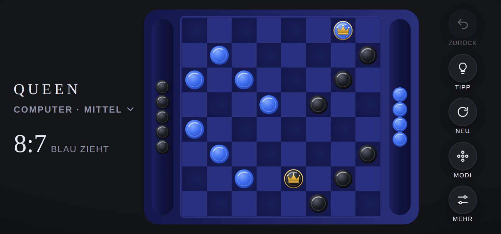

# Design

[English version](../en/design.md) · [Übersicht](README.md)

## Leitidee

QUEEN ist ein Damebrett, das man gern auf dem Tisch liegen hätte: tiefblaues Holz mit Lack, Steine aus glasierter Keramik, eine goldene Krone für jede Dame. Kein Effekt lenkt vom Spiel ab. Jede Bewegung erklärt, was gerade passiert: welcher Stein zieht, welcher geschlagen wird, wer gekrönt wird.

Schriften, Oberflächenfarben, Abstände und alle Bausteine der Oberfläche (Kopfzeile, Steuerleiste, Blätter, Ergebniskarte) kommen aus der [Hülle](../../../shared/README.de.md). Dieses Dokument beschreibt nur, was QUEEN eigen ist.

## Farben

Das Brett sieht in Hell und Dunkel gleich aus. Nur die Oberfläche rundherum folgt dem Modus des Geräts.

| Element | Farben | Wirkung |
|---|---|---|
| Brettplatte | Verlauf von `#2a2f7a` nach `#14174a` | Tiefblaues, lackiertes Holz |
| Rahmen um die Felder | `#232870` mit Kante `#2f3588` | Leicht erhabene Spielfläche |
| Dunkle Felder | Radialer Verlauf von `#1b1f5a` nach `#121547` | Die 32 Spielfelder, sanft gewölbt |
| Helle Felder | `#2a3080` | Bewusst nah an den dunklen Feldern, damit das Brett ruhig bleibt |
| Schalen | Verlauf von `#0b0d33` über `#121543` nach `#1c2060` | Eingelassene Rinne mit Tiefe |
| Blaue Steine | Verlauf von `#86abff` über `#3f6ef0` nach `#2142b4` | Glasierte Keramik, hell von oben links beleuchtet |
| Schwarze Steine | Verlauf von `#5e616e` über `#1d1e26` nach `#07070a` | Dunkle Keramik mit Glanzlicht |
| Krone | Verlauf von `#ffe7a0` über `#e3b448` nach `#a87a1c`, Kontur `#8a6414` | Gold, auf beiden Steinfarben gut sichtbar |
| Zielringe | Weiß, gepunktet, pulsierend | Erlaubte Ziele des ausgewählten Steins |
| Tippring | Durchgehender Ring in der Tippfarbe der Hülle (`--hint`) | Vorschlag des Computers |

## Geometrie

Alles wird in einem festen Brettraum von **1000 × 1280 Einheiten** im Hochformat gezeichnet. Die Darstellung skaliert diesen Raum auf den verfügbaren Platz.

| Größe | Wert | Begründung |
|---|---|---|
| Platte | Abgerundetes Rechteck über den ganzen Brettraum | Platz für Brett und zwei Schalen |
| Brett | 920 × 920, ab Position (40, 180) | Füllt fast die ganze Breite |
| Feld | 115 | Auf einem iPhone etwa 45 pt, also über der Mindestgröße von 44 pt für Tippflächen |
| Stein | Radius 44 | Füllt ein Feld zu drei Vierteln, mit sichtbarem Rand |
| Stein in der Schale | Radius 34 | Etwas kleiner, damit alle 12 geschlagenen Steine einer Seite Platz finden |
| Schale Blau | Mittellinie bei y = 1192, nutzbare Länge 880 | Unter dem Brett |
| Schale Schwarz | Mittellinie bei y = 88, nutzbare Länge 880 | Über dem Brett |

**Warum keine runde Platte wie bei SPRING?** Ein quadratisches Brett in einem Kreis würde jedes Feld auf etwa 25 pt schrumpfen lassen, deutlich unter der Mindestgröße für sichere Bedienung mit dem Finger. Die abgerundete Platte greift die Formensprache von SPRING auf und lässt den Feldern den nötigen Platz.

## Steine und Krone

Jeder Stein besteht aus Schatten, Körper mit Verlauf, einem feinen inneren Ring, einem Glanzlicht und der Krone.

* Die **Krone** ist eine goldene Zackenkrone mit Reif und drei hellen Perlen. Sie liegt auf jedem Stein bereit und wird bei der Krönung eingeblendet.
* Licht und Krone bleiben immer aufrecht. Dreht sich das Brett (Querformat oder Spiel zu zweit), dreht eine innere Gruppe jeden Stein zurück. So fällt das Licht immer von oben links, und die Krone steht nie auf dem Kopf.

## Ausrichtung

| Situation | Darstellung |
|---|---|
| Hochformat | Blau unten, Schwarz oben, Schalen über und unter dem Brett |
| Querformat | Das Brett ist um 90° gedreht: Blau links, Schwarz rechts, Schalen links und rechts |
| Zu zweit mit „Brett drehen“ | Nach jedem Zug dreht sich das Brett um 180° zur Person am Zug |

Die Neigung des Geräts wird in den Brettraum zurückgerechnet, damit Steine in den Schalen in jeder Ausrichtung zur tatsächlich tieferen Seite rutschen.

## Bewegung

| Moment | Animation | Dauer |
|---|---|---|
| Stein auswählen | Hebt sich leicht an, Ziele erscheinen | sofort |
| Zug | Kleiner Bogen von Feld zu Feld | 260 ms |
| Schlag | Etwas höherer Bogen je Sprung, Feld für Feld entlang des Wegs | 300 ms je Sprung |
| Gezogener Stein, losgelassen | Gleitet ohne Bogen ins Ziel | 160 ms |
| Geschlagener Stein | Rollt in einem flachen Bogen in die Schale und wird dabei kleiner, mehrere Steine nacheinander im Abstand von 90 ms | 420 ms |
| Krönung | Krone blendet ein, der Stein hebt sich kurz an | 520 ms |
| Ungültiger Stein | Wackelt seitlich | 260 ms |
| Neues Spiel, Zurück, Moduswechsel | Jeder Stein gleitet an seinen Platz, Steine aus den Schalen kommen zurück | 380 ms |

Animationen laufen nacheinander über eine Warteschlange. Ein schneller Tipp auf Zurück geht deshalb nie verloren.

## Layouts

| Situation | Anordnung |
|---|---|
| iPhone hoch | Schriftzug, Modus und Zähler oben, Brett mittig, fünf Schaltflächen unten. Modi und Einstellungen als Blätter von unten |
| iPhone quer | Schriftzug und Zähler links, gedrehtes Brett mittig, Schaltflächen rechts. Modi als Schublade |
| iPhone SE | Zähler zweizeilig und etwas kleiner, damit die Kopfzeile nicht umbricht |
| iPad hoch | Wie iPhone hoch, mit mehr Platz |
| iPad quer | Feste Seitenleiste mit allen Modi, Brett und Steuerung rechts |

## Kopfzeile

| Element | Inhalt |
|---|---|
| Untertitel | Aktueller Modus, zum Beispiel „Computer · Mittel“ oder „Zu zweit“ |
| Zähler | Steine Blau zu Schwarz, zum Beispiel `9:7` |
| Zeile darunter | „Blau zieht“, „Schwarz zieht“ oder „Schwarz denkt“ |

## Modusauswahl

Jede Karte zeigt eine kleine Brettvorschau, den Namen, die Schwierigkeit als Punkte und die Sterne. Darunter steht die Zahl der Siege, solange es noch keinen gibt „Computer“, beim Spiel zu zweit „Ein Gerät“. Der aktive Modus trägt einen Rahmen in der Akzentfarbe.

## App-Symbol

Ein blauer Stein mit goldener Krone vor einem schwarzen Stein auf tiefblauem Grund. Quelle ist `icons/icon.svg`, daraus entstehen PNG-Dateien in 180, 192 und 512 Pixeln.
