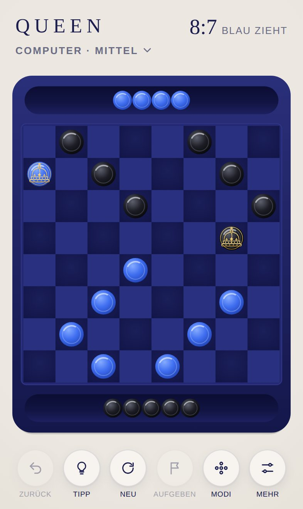

# Design

[English version](../en/design.md) · [Übersicht](README.md)

## Leitidee

QUEEN ist ein Damebrett, das man gern auf dem Tisch liegen hätte. Wenige, echte Materialien: schwarzes Holz, Ahorn, Ebenholz, Elfenbein und feines Gold. Gold ist dabei nie Fläche, sondern Linie: um das Brett, in den Koordinaten, in der Krone. Kein Effekt lenkt vom Spiel ab. Jede Bewegung erklärt, was gerade passiert: welcher Stein zieht, welcher geschlagen wird, wer gekrönt wird.

Schriften, Oberflächenfarben, Abstände und alle Bausteine der Oberfläche (Kopfzeile, Steuerleiste, Blätter, Ergebniskarte) kommen aus der [Hülle](../../../shared/README.de.md). Dieses Dokument beschreibt nur, was QUEEN eigen ist.

## Brettstile

QUEEN hat zwei Brettstile, wählbar unter **Mehr > Brett**. Beide nutzen dieselbe Geometrie, dieselbe Krone und dieselben Animationen. Ein Stil besteht nur aus Farben und Mustern (`js/themes.js`), ein Wechsel tauscht sie aus, ohne das Spiel zu unterbrechen.

| | Klassik (Standard) | Mitternacht |
|---|---|---|
| Wirkung | Edles Holzbrett mit Goldeinlage | Ruhiges, tiefblaues Lackbrett |
| Seiten | Weiß (Elfenbein) unten, Schwarz (Ebenholz) oben | Blau unten, Schwarz oben |
| Steine | Gedrechseltes Holz mit Drechselring | Glasierte Keramik |
| Koordinaten | A bis H und 1 bis 8 in Gold | keine |

&nbsp;&nbsp;

## Farben im Stil Klassik

| Element | Farben | Wirkung |
|---|---|---|
| Brettplatte | Verlauf von `#1d1a17` nach `#0f0d0c`, feine Maserung | Mattes schwarzes Holz |
| Rahmen | `#161412` mit Goldlinie `#c9a24a`, innen eine zweite feine Goldlinie | Eingelegte Goldader |
| Helle Felder | Verlauf von `#efdcb6` nach `#dcc394` mit Maserung | Ahorn |
| Dunkle Felder | Verlauf von `#2a241e` nach `#1d1915` mit Maserung | Warmes Ebenholz, nicht ganz schwarz |
| Schalen | Verlauf von `#080706` nach `#1c1916`, Rautengitter und Kante in Gold | Eingefräste Rinne |
| Weiße Steine | Verlauf von `#fffaf0` über `#efe4cb` nach `#cdb88f` | Elfenbeinfarbenes Holz, matt |
| Schwarze Steine | Verlauf von `#57514c` über `#1b1816` nach `#050404`, heller Rand | Glänzendes Ebenholz |
| Koordinaten | `#c9a24a` in Didot | Wie auf einem Turnierbrett |

**Schwarz auf Schwarz:** Gespielt wird auf den dunklen Feldern, schwarze Steine stehen also auf fast schwarzem Grund. Drei Mittel halten sie gut sichtbar: Die dunklen Felder sind ein warmes Braunschwarz, die Steine haben Glanz und einen feinen hellen Rand, und jeder Stein wirft einen weichen Schatten.

## Farben im Stil Mitternacht

| Element | Farben | Wirkung |
|---|---|---|
| Brettplatte | Verlauf von `#2a2f7a` nach `#14174a` | Tiefblaues, lackiertes Holz |
| Rahmen | `#232870` mit Kante `#2f3588` | Leicht erhabene Spielfläche |
| Dunkle Felder | Radialer Verlauf von `#1b1f5a` nach `#121547` | Sanft gewölbt |
| Helle Felder | `#2a3080` | Bewusst nah an den dunklen Feldern, damit das Brett ruhig bleibt |
| Schalen | Verlauf von `#0b0d33` über `#121543` nach `#1c2060` | Eingelassene Rinne mit Tiefe |
| Blaue Steine | Verlauf von `#86abff` über `#3f6ef0` nach `#2142b4` | Glasierte Keramik |
| Schwarze Steine | Verlauf von `#5e616e` über `#1d1e26` nach `#07070a` | Dunkle Keramik mit Glanzlicht |

In beiden Stilen gilt: Zielringe sind weiß, gepunktet und pulsieren. Der Tippring ist ein durchgehender Ring in der Tippfarbe der Hülle (`--hint`). Der letzte Zug wird dezent markiert: Start- und Zielfeld werden leicht heller (`q-last`, im Stil Klassik ein warmes Elfenbein mit 13 % Deckkraft, im Stil Mitternacht ein helles Blau mit 12 %).

## Geometrie

Alles wird in einem festen Brettraum von **1000 × 1280 Einheiten** im Hochformat gezeichnet. Im Querformat wird die Platte breiter (**1280 × 1040 Einheiten**), das Brett bleibt an seinem Platz, nur die Schalen wandern an die Seiten. Die Darstellung wählt die Form, in der das Brett größer erscheint, und skaliert sie auf den verfügbaren Platz.

| Größe | Wert | Begründung |
|---|---|---|
| Platte | Abgerundetes Rechteck über den ganzen Brettraum | Platz für Brett, Koordinaten und zwei Schalen |
| Brett | 920 × 920, ab Position (40, 180) | Füllt fast die ganze Breite |
| Feld | 115 | Auf einem iPhone etwa 45 pt, also über der Mindestgröße von 44 pt für Tippflächen |
| Stein | Radius 44 | Füllt ein Feld zu drei Vierteln, mit sichtbarem Rand |
| Stein in der Schale | Radius 34 | Etwas kleiner, damit alle 12 geschlagenen Steine einer Seite Platz finden |
| Schale der unteren Seite | Mittellinie bei y = 1192, nutzbare Länge 880 | Unter dem Brett |
| Schale der oberen Seite | Mittellinie bei y = 88, nutzbare Länge 880 | Über dem Brett |
| Koordinaten | Schriftgröße 25, Buchstaben unter dem Brett, Zahlen links | Zwischen Brett und Schale |

**Warum keine runde Platte wie bei SPRING?** Ein quadratisches Brett in einem Kreis würde jedes Feld auf etwa 25 pt schrumpfen lassen, deutlich unter der Mindestgröße für sichere Bedienung mit dem Finger. Die abgerundete Platte greift die Formensprache von SPRING auf und lässt den Feldern den nötigen Platz.

## Die Krone

Die Krone der Dame ist eine **Königinnenkrone als feine Goldgravur**, als wäre sie in den Stein eingelegt. Sie besteht nur aus Linien und kleinen Punkten, ohne Farben:

| Teil | Darstellung |
|---|---|
| Kreuz | Tatzenkreuz ganz oben |
| Reichsapfel | Kugel mit Querband |
| Bügel | Zwei äußere Bügel und ein vorderer Bügel, mit Perlen als gravierte Punkte |
| Lilien und Kreuz | Auf dem Reif: Tatzenkreuz in der Mitte, Lilien links und rechts |
| Reif | Mit fünf gravierten Steinen |
| Hermelin | Unterer Rand mit vier Hermelinschwänzen |
| Ring | Feine Goldlinie entlang des Steinrands |

Unter jeder Goldlinie liegt eine feine Schattenlinie, das wirkt eingelegt. Auf Elfenbein ist das Gold dunkler (Altgold `#b8892c` bis `#7d5a14`), auf Ebenholz und Keramik heller (`#fbe3a0` bis `#d4a443`), damit die Gravur auf jedem Stein gut lesbar bleibt. Die Formen stehen als Pfade in `CROWN` in `js/themes.js`.

Licht und Krone bleiben immer aufrecht. Dreht sich das Brett (Spiel zu zweit), dreht eine innere Gruppe jeden Stein zurück. So fällt das Licht immer von oben links, und die Krone steht nie auf dem Kopf. Dasselbe gilt für die Koordinaten.

## Ausrichtung

| Situation | Darstellung |
|---|---|
| Hochformat | Untere Seite unten, Schwarz oben, Schalen über und unter dem Brett |
| Querformat | Die untere Seite bleibt unten wie am echten Tisch. Die Platte wird breiter, die Schalen stehen links (Schwarz) und rechts (untere Seite). Geschlagene Steine füllen die rechte Schale von unten und die linke von oben |
| Zu zweit mit „Brett drehen“ | Nach jedem Zug dreht sich das Brett um 180° zur Person am Zug |

Die Neigung des Geräts wird in den Brettraum zurückgerechnet, damit Steine in den Schalen in jeder Ausrichtung zur tatsächlich tieferen Seite rutschen.

## Bewegung

| Moment | Animation | Dauer |
|---|---|---|
| Stein auswählen | Hebt sich leicht an, Ziele erscheinen | sofort |
| Zug | Kleiner Bogen von Feld zu Feld | 260 ms |
| Schlag | Etwas höherer Bogen je Sprung, Feld für Feld entlang des Wegs | 300 ms je Sprung |
| Gezogener Stein, losgelassen | Gleitet ohne Bogen ins Ziel | 160 ms |
| Geschlagener Stein | Rollt in einem flachen Bogen in die Schale und wird dabei kleiner, mehrere Steine nacheinander im Abstand von 90 ms | 420 ms |
| Computerzug | Denkpause mindestens 0,7 s, Stein hebt sich an (0,38 s), zieht ruhig (0,52 s je Sprung, 0,14 s Pause dazwischen), übersprungene Steine verblassen sofort | etwa 1,5 s |
| Letzter Zug | Start- und Zielfeld bleiben leicht aufgehellt, bis wieder gezogen wird | bleibt |
| Krönung | Die Gravur blendet ein und wächst leicht auf, der Stein hebt sich kurz an | 520 ms |
| Wechsel des Brettstils | Brett blendet aus und im neuen Stil wieder ein | 330 ms |
| Ungültiger Stein | Wackelt seitlich | 260 ms |
| Neues Spiel, Zurück, Moduswechsel | Jeder Stein gleitet an seinen Platz, Steine aus den Schalen kommen zurück | 380 ms |

Animationen laufen nacheinander über eine Warteschlange. Ein schneller Tipp auf Zurück geht deshalb nie verloren.

## Layouts

| Situation | Anordnung |
|---|---|
| iPhone hoch | Schriftzug, Modus und Zähler oben, Brett mittig, sechs Schaltflächen unten (Zurück, Tipp, Neu, Aufgeben, Modi, Mehr), etwas kleiner als bei fünf. Modi und Einstellungen als Blätter von unten |
| iPhone quer | Schriftzug, Modus und Zähler links, Brett mittig mit Schalen links und rechts, Schaltflächen rechts. Modi als Schublade von links |
| iPhone SE | Zähler zweizeilig und etwas kleiner, damit die Kopfzeile nicht umbricht |
| iPad hoch | Wie iPhone hoch, mit mehr Platz |
| iPad quer | Wie iPhone quer, mit größeren Schaltflächen. Das Brett nutzt die volle Höhe, die Modi kommen als Schublade über den Modusnamen, Modi oder „Anderer Modus“ auf der Ergebniskarte |

## Kopfzeile

| Element | Inhalt |
|---|---|
| Untertitel | Aktueller Modus, zum Beispiel „Computer · Mittel“ oder „Zu zweit“ |
| Zähler | Steine der unteren Seite zu Schwarz, zum Beispiel `9:7` |
| Zeile darunter | „Weiß zieht“ (im Stil Mitternacht „Blau zieht“), „Schwarz zieht“ oder „Schwarz denkt“ |

## Modusauswahl

Jede Karte zeigt eine kleine Brettvorschau im gewählten Stil, den Namen, die Schwierigkeit als Punkte und die Sterne. Darunter steht die Zahl der Siege, solange es noch keinen gibt „Computer“, beim Spiel zu zweit „Ein Gerät“. Der aktive Modus trägt einen Rahmen in der Akzentfarbe.

## App-Symbol

Ein Ausschnitt des Bretts von oben auf Ochsenblut-Rot, ohne Rahmen: oben zwei Ebenholzsteine, unten zwei Elfenbeinsteine, in der Mitte eine Dame aus zwei gestapelten Elfenbeinsteinen mit der gravierten Goldkrone. Gleiche Bildsprache wie die übrigen Spiele der Sammlung: Spielmaterial von oben, Licht von oben links, weicher Schatten, eine kräftige Farbe je Spiel. Quelle ist `icons/icon.svg`, erzeugt von `tools/icons.mjs`, daraus entstehen PNG-Dateien in 180, 192 und 512 Pixeln.
