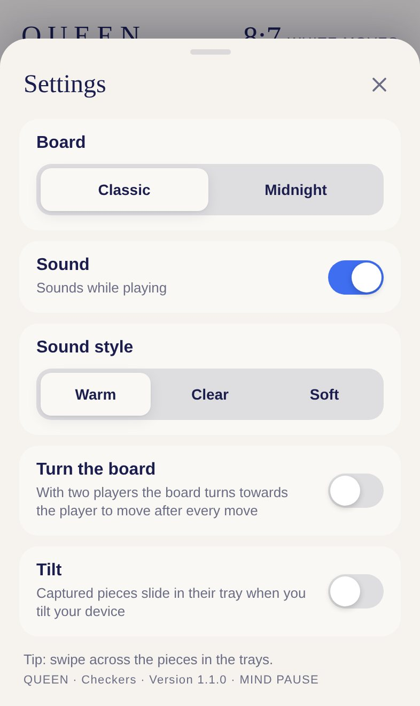

# QUEEN · Documentation

[Deutsche Version](../de/README.md) · [Back to the project](../../README.md)

This documentation describes QUEEN completely: how to play, how it looks and sounds, how the computer opponent thinks, how the game is built and how to develop and publish it.

| Document | Contents | Audience |
|---|---|---|
| [Gameplay](gameplay.md) | Rules of German checkers, modes, draws, stars, controls, trays, settings | Everyone |
| [Design](design.md) | Classic and Midnight board styles, colours, crown, trays, orientation, layouts, motion | Design, development |
| [Sound design](sound.md) | The sounds of QUEEN on the sound engine of the shell | Design, development |
| [Architecture](architecture.md) | Modules, rules engine, game state, computer opponent, rendering, flow of a move | Development |
| [Development](development.md) | Running locally, tests, conventions, testing on an iPhone | Development |
| [Extending](extending.md) | Levels, evaluation, rule variants, playing on two devices, roadmap | Development |
| [Deployment](deployment.md) | Address, offline storage, progress, troubleshooting | Operations |

## QUEEN at a glance

| | |
|---|---|
| Game | German checkers (Deutsche Dame) on 8×8 squares, 12 pieces per side |
| Modes | Computer Beginner, Easy, Medium, Hard and Two players on one device |
| Contents | Resign, last move marker, two board styles, engraved golden crown, hints, undo, stars and statistics per mode, turning board for two players |
| Platform | Progressive web app for iPhone and iPad, runs in every modern browser |
| Languages | German and English, chosen automatically from the device language |
| Technology | HTML, CSS, JavaScript modules, SVG, Web Audio, Web Worker, no framework, no build step |
| Hosting | GitHub Pages, playable offline |
| Collection | Part of [MIND PAUSE](../../../README.md), interface from the [shell](../../../shared/README.md) |
| Address | https://michaeldobner.github.io/mindpause/queen/ |
| Version | 1.2.0 |

&nbsp;

