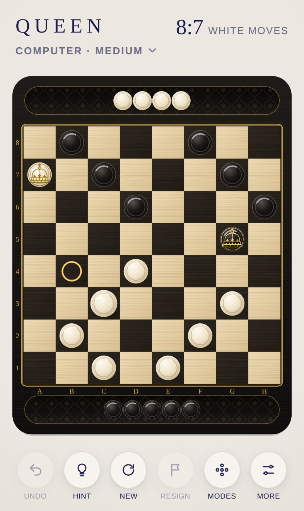
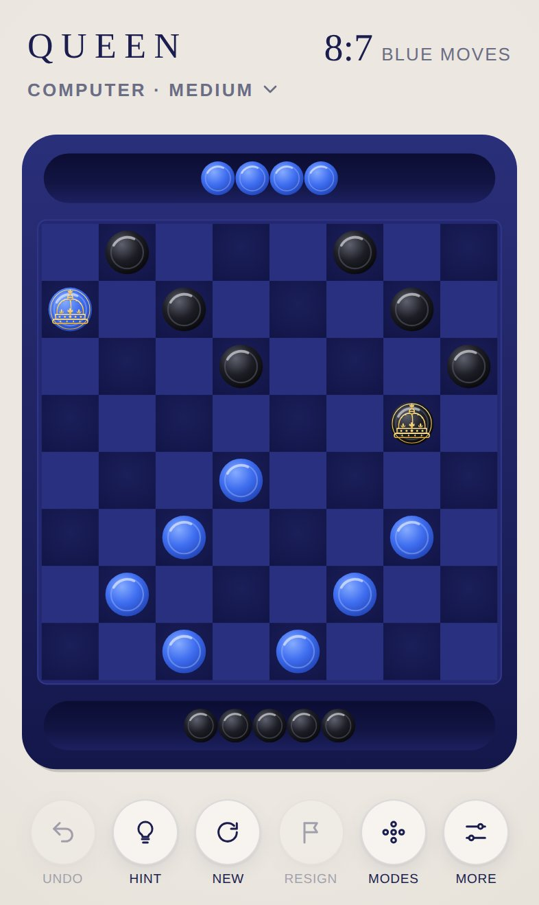
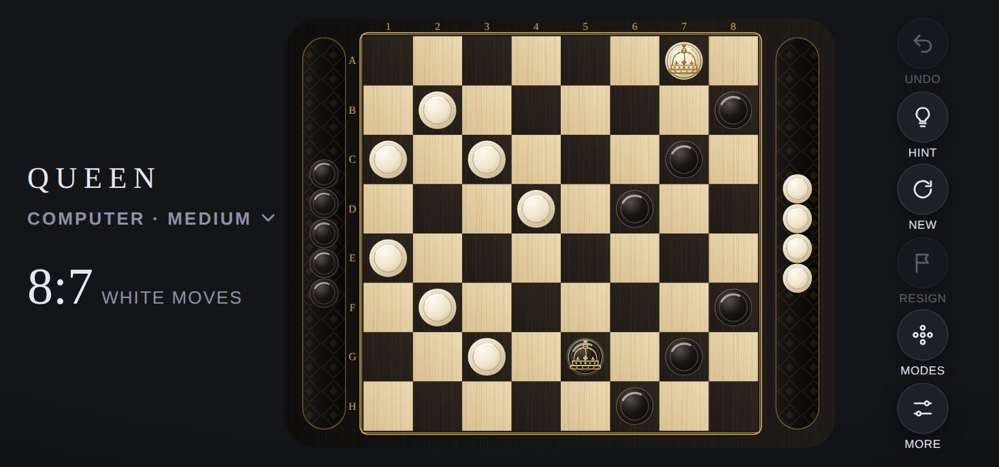
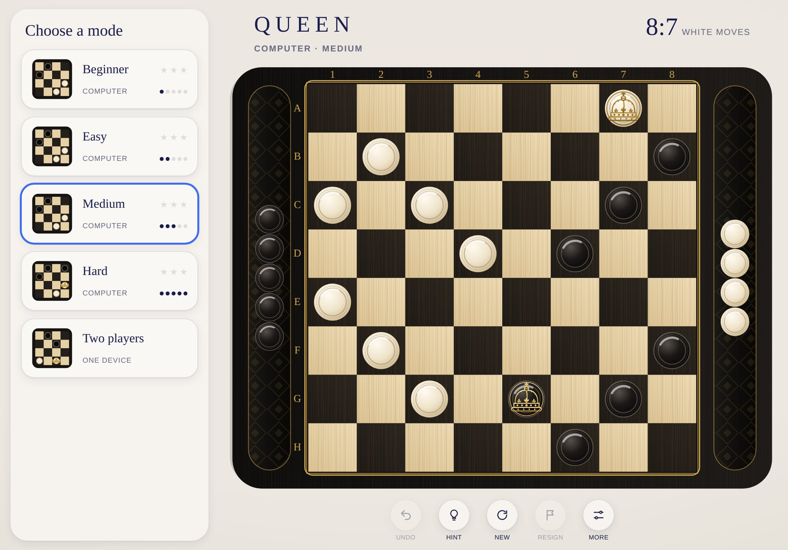

# Design

[Deutsche Version](../de/design.md) · [Overview](README.md)

## Guiding idea

QUEEN is a checkerboard you would like to have on your table. Few, genuine materials: black wood, maple, ebony, ivory and fine gold. Gold is never a surface, always a line: around the board, in the coordinates, in the crown. No effect distracts from the game. Every motion explains what is happening: which piece moves, which one is captured, who is crowned.

Fonts, interface colours, spacing and all interface components (header, control bar, sheets, result card) come from the [shell](../../../shared/README.md). This document only describes what is specific to QUEEN.

## Board styles

QUEEN has two board styles, chosen under **More > Board**. Both share the same geometry, the same crown and the same animations. A style consists only of colours and patterns (`js/themes.js`), and switching replaces them without interrupting the game.

| | Classic (default) | Midnight |
|---|---|---|
| Character | Fine wooden board with gold inlay | Calm, deep blue lacquered board |
| Sides | White (ivory) at the bottom, Black (ebony) at the top | Blue at the bottom, Black at the top |
| Pieces | Turned wood with a turning ring | Glazed ceramic |
| Coordinates | A to H and 1 to 8 in gold | none |

&nbsp;&nbsp;

## Colours of the Classic style

| Element | Colours | Effect |
|---|---|---|
| Board plate | Gradient from `#1d1a17` to `#0f0d0c`, fine grain | Matt black wood |
| Frame | `#161412` with gold line `#c9a24a`, a second fine gold line inside | Inlaid gold vein |
| Light squares | Gradient from `#efdcb6` to `#dcc394` with grain | Maple |
| Dark squares | Gradient from `#2a241e` to `#1d1915` with grain | Warm ebony, not quite black |
| Trays | Gradient from `#080706` to `#1c1916`, diamond lattice and edge in gold | Milled channel |
| White pieces | Gradient from `#fffaf0` via `#efe4cb` to `#cdb88f` | Ivory coloured wood, matt |
| Black pieces | Gradient from `#57514c` via `#1b1816` to `#050404`, light edge | Glossy ebony |
| Coordinates | `#c9a24a` in Didot | As on a tournament board |

**Black on black:** play happens on the dark squares, so black pieces stand on an almost black ground. Three things keep them clearly visible: the dark squares are a warm brownish black, the pieces have a gloss and a fine light edge, and every piece casts a soft shadow.

## Colours of the Midnight style

| Element | Colours | Effect |
|---|---|---|
| Board plate | Gradient from `#2a2f7a` to `#14174a` | Deep blue lacquered wood |
| Frame | `#232870` with edge `#2f3588` | Slightly raised playing area |
| Dark squares | Radial gradient from `#1b1f5a` to `#121547` | Gently domed |
| Light squares | `#2a3080` | Deliberately close to the dark squares so the board stays calm |
| Trays | Gradient from `#0b0d33` via `#121543` to `#1c2060` | Recessed channel with depth |
| Blue pieces | Gradient from `#86abff` via `#3f6ef0` to `#2142b4` | Glazed ceramic |
| Black pieces | Gradient from `#5e616e` via `#1d1e26` to `#07070a` | Dark ceramic with a highlight |

In both styles target rings are white, dotted and pulsing. The hint ring is a solid ring in the hint colour of the shell (`--hint`). The last move is marked subtly: the start and target squares become slightly lighter (`q-last`, a warm ivory at 13 % opacity in the Classic style, a light blue at 12 % in Midnight).

## Geometry

Everything is drawn in a fixed board space of **1000 × 1280 units** in portrait. The rendering scales this space to the available room.

| Size | Value | Reason |
|---|---|---|
| Plate | Rounded rectangle across the whole board space | Room for the board, coordinates and two trays |
| Board | 920 × 920, from position (40, 180) | Fills almost the full width |
| Square | 115 | About 45 pt on an iPhone, above the 44 pt minimum for touch targets |
| Piece | Radius 44 | Fills three quarters of a square, with a visible margin |
| Piece in a tray | Radius 34 | A little smaller so all 12 captured pieces of one side fit |
| Tray of the bottom side | Centre line at y = 1192, usable length 880 | Below the board |
| Tray of the top side | Centre line at y = 88, usable length 880 | Above the board |
| Coordinates | Font size 25, letters below the board, numbers on the left | Between board and tray |

**Why not a round plate as in SPRING?** A square board inside a circle would shrink every square to about 25 pt, well below the minimum size for reliable finger input. The rounded plate echoes the shapes of SPRING and gives the squares the room they need.

## The crown

The queen's crown is a **queen's crown as a fine gold engraving**, as if inlaid into the piece. It consists only of lines and small dots, without colours:

| Part | Rendering |
|---|---|
| Cross | Cross pattée at the very top |
| Orb | Sphere with a band |
| Arches | Two outer arches and a front arch, with pearls as engraved dots |
| Fleurs-de-lis and cross | On the band: a cross pattée in the middle, fleurs-de-lis left and right |
| Band | With five engraved stones |
| Ermine | Lower rim with four ermine tails |
| Ring | Fine gold line along the edge of the piece |

A fine shadow line lies beneath every gold line, which makes it look inlaid. On ivory the gold is darker (antique gold `#b8892c` to `#7d5a14`), on ebony and ceramic it is brighter (`#fbe3a0` to `#d4a443`), so the engraving stays legible on every piece. The shapes are paths in `CROWN` in `js/themes.js`.

Light and crown always stay upright. When the board turns (landscape or two players), an inner group turns each piece back. Light always falls from the top left, and the crown is never upside down. The same applies to the coordinates.

## Orientation

| Situation | Rendering |
|---|---|
| Portrait | Bottom side at the bottom, Black at the top, trays above and below the board |
| Landscape | The board is turned by 90°: bottom side on the left, Black on the right, trays left and right |
| Two players with "Turn the board" | After every move the board turns by 180° towards the player to move |

The tilt of the device is turned back into board space, so pieces in the trays slide to the side that is actually lower in every orientation.

## Motion

| Moment | Animation | Duration |
|---|---|---|
| Select a piece | Lifts slightly, targets appear | immediate |
| Move | Small arc from square to square | 260 ms |
| Capture | A slightly higher arc per jump, square by square along the path | 300 ms per jump |
| Dragged piece released | Glides into the target without an arc | 160 ms |
| Captured piece | Rolls in a flat arc into the tray and shrinks, several pieces one after another 90 ms apart | 420 ms |
| Computer move | Thinking pause at least 0.7 s, the piece lifts (0.38 s), moves calmly (0.52 s per jump, 0.14 s pause in between), jumped pieces fade at once | about 1.5 s |
| Last move | Start and target squares stay slightly lighter until the next move | stays |
| Crowning | The engraving fades in and grows slightly, the piece lifts briefly | 520 ms |
| Board style switch | The board fades out and back in with the new style | 330 ms |
| Piece without moves | Wiggles sideways | 260 ms |
| New game, undo, mode switch | Every piece glides to its place, pieces return from the trays | 380 ms |

Animations run one after another through a queue, so a quick tap on Undo is never lost.

## Layouts

| Situation | Arrangement |
|---|---|
| iPhone portrait | Wordmark, mode and counter at the top, board in the middle, six buttons at the bottom (Undo, Hint, New, Resign, Modes, More), a little smaller than with five. Modes and settings as sheets from the bottom |
| iPhone landscape | Wordmark and counter on the left, turned board in the middle, buttons on the right. Modes as a drawer |
| iPhone SE | Counter on two lines and a little smaller, so the header never wraps |
| iPad portrait | Like iPhone portrait, with more room |
| iPad landscape | Fixed sidebar with all modes, board and controls on the right |

## Header

| Element | Contents |
|---|---|
| Subtitle | Current mode, for example "Computer · Medium" or "Two players" |
| Counter | Pieces of the bottom side to Black, for example `9:7` |
| Line below | "White moves" ("Blue moves" in the Midnight style), "Black moves" or "Black thinks" |

## Choosing a mode

Each card shows a small board preview in the chosen style, the name, the difficulty as dots and the stars. Below it is the number of wins, "Computer" while there are none yet, and "One device" for two players. The active mode has a frame in the accent colour.

## App icon

A section of the board seen from above on oxblood red, without a frame: two ebony pieces at the top, two ivory pieces at the bottom, and in the middle a king made of two stacked ivory pieces with the engraved golden crown. Same visual language as the other games of the collection: game material from above, light from the top left, a soft shadow, one strong colour per game. The source is `icons/icon.svg`, generated by `tools/icons.mjs`, from which PNG files in 180, 192 and 512 pixels are made.
